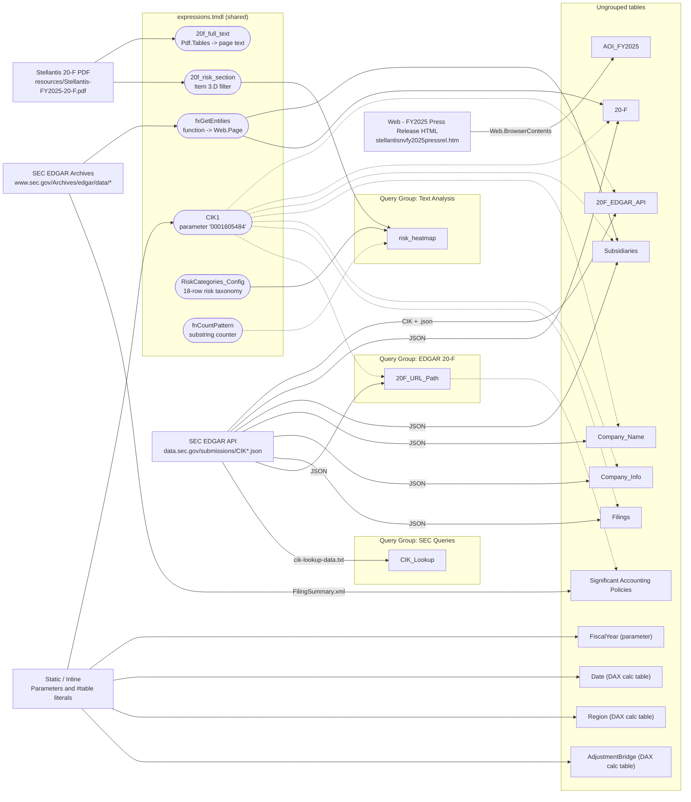
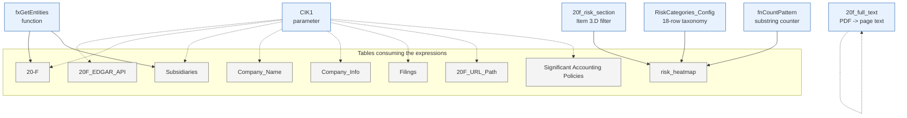
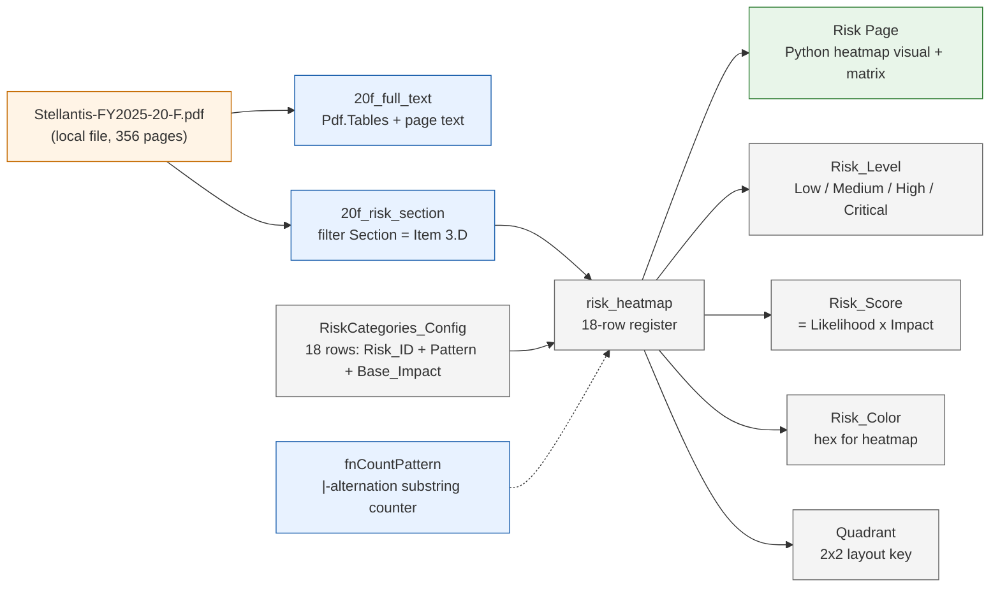
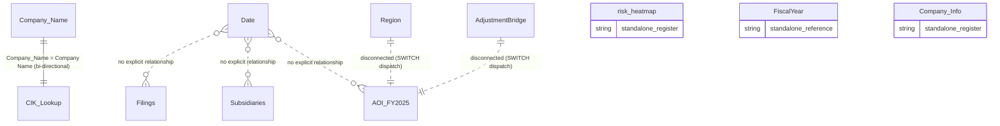

# Semantic Model Reference — `STLA_20-F_Model`

> Generated: 2026-05-27  |  Source: live TOM extraction from Power BI Desktop  |  Snapshot file: `tmp/model_snapshot.json`

This document is the canonical developer reference for the `STLA_20-F_Model.SemanticModel` Power BI tabular model. It is regeneratable on demand from the running PBI Desktop instance via the extraction script at `STLA_Power_BI/.claude/scripts/extract-model-metadata.ps1` (see § 15. Reproduction Guide). It sits alongside `STLA_Power_BI/docs/AOI_Overview.md` and `STLA_Power_BI/docs/Risk_Tab.md` as the third pillar of the project's developer-doc corpus.

## 1. Executive Summary

The `STLA_20-F_Model` is a Power BI tabular model that surfaces Stellantis N.V.'s SEC Form 20-F filing and FY2025 adjusted operating income (AOI) reconciliation for analytical reporting. It is a **thick PBIP** project — the report (`STLA_20-F_Model.Report`) connects to the co-located semantic model via `byPath` rather than to a published Fabric / Power BI service workspace.

**Headline counts** (verified against the live TOM model, compatibility level `1600`):

| Object class | Count |
|---|---:|
| Tables (total) | 25 |
| Tables (visible) | 16 |
| Tables (auto-generated date) | 8 (`1 × DateTableTemplate_*` + `7 × LocalDateTable_*`) |
| Relationships | 9 |
| Relationships (user-defined, non-LocalDateTable) | 1 |
| Measures | 88 (all on `AOI_FY2025`) |
| Measure display folders | 8 |
| Shared M expressions | 6 |
| Query groups | 3 (`SEC Queries`, `EDGAR 20-F`, `Text Analysis`) |
| Roles (RLS) | 0 |
| Cultures | 1 (`en-US`, `translationCount = 0`) |
| Perspectives | 0 |
| Sensitivity labels | 0 |

**Who uses it.** Stellantis FP&A and IR analysts consume three report tabs backed by the model: AOI Overview (88 measures, region matrix, FaSTLAne 2030 scenario), SEC Filings (every 20-F lodged on EDGAR), Risk (18-category heatmap derived from Item 3.D of the 20-F PDF), and Subsidiaries (geographic roll-up of Exhibit 8.1 entities).

**The three biggest known issues.**

1. **Auto Date/Time is enabled**, producing seven `LocalDateTable_*` shadows of the explicit `Date` table. This bloats the model and routes every active date relationship through the hidden shadow rather than the user-defined `Date` table. Remediation in § 14.1.
2. **Compatibility level `1600`** — below the `1601` threshold that unlocks DAX user-defined functions, forcing the repeating `SUBSTITUTE / TRIM` parse pattern (see § 8.1) to be copy-pasted across the 37 AOI core measures that read the wide-format `AOI_FY2025` table.
3. **Zero RLS, OLS, perspectives, or sensitivity labels.** The model surfaces SEC-filing financials with no model-layer access control or classification metadata. Remediation list in § 11.3.

The model is **fully functional and currently in production use**; the issues above are remediation candidates, not blockers.

## 2. Document Conventions

- **Identifiers** (table names, column names, measure names, M expression names, DAX functions, file paths) are in `monospace backticks`. Where a column belongs to a non-obvious table, the table qualifier is included (`'AOI_FY2025'[OTHER(*)]`).
- **DAX code** lives in fenced `dax` blocks; **Power Query M** in fenced `powerquery` blocks; **PowerShell** in fenced `powershell` blocks.
- **Mermaid diagrams** use the `mermaid` fence and render on GitHub, Azure DevOps, and any CommonMark renderer with Mermaid support. The diagram sources are also checked in under `tmp/diagrams/*.mmd` for use with the standalone Mermaid CLI (`mmdc`).
- **Cardinality glyphs** in the ERD follow Mermaid conventions: `||--o{` one-to-many active, `||..||` one-to-one logical-only (no physical relationship), `}o..o{` many-to-many logical-only.
- **Format strings** are quoted verbatim from `model.Tables[*].Measures[*].FormatString`. The `\` characters in format strings such as `mmmm d\, yyyy` are TMDL escapes, not literal backslashes — they prevent the comma from being parsed as a section separator.
- **Footnote citations** (`[^rls]`, `[^autodate]`, …) point to Microsoft Learn URLs; the consolidated table is in § 17. References.
- **No emojis.** Identifiers in backticks. Tables for verified values; prose for narrative.

## 3. Model Metadata

The following metadata is read straight from the running TOM model (`Server.Databases[0].Model`):

| Property | Value |
|---|---|
| `database.name` / `database.id` | `eda70504-607f-4677-b5a7-867cff756aef` (GUID — PBI Desktop assigns; not human-meaningful) |
| `compatibilityLevel` | `1600` |
| `compatibilityMode` | `PowerBI` |
| `modelName` | `Model` |
| `modelDescription` | _(empty)_ |
| `culture` | `en-US` |
| `defaultMode` | `Import` |
| `discourageImplicitMeasures` | `false` |
| `sourceQueryCulture` | `en-US` |
| `storageLocation` | _(null — PBI Desktop in-memory)_ |

**Model-level annotations** that materially affect behavior:

| Annotation | Value | Meaning |
|---|---|---|
| `__PBI_TimeIntelligenceEnabled` | `"1"` | Auto Date/Time is on. Every `date` / `dateTime` column gets a hidden `LocalDateTable_*` shadow. See § 14.1. |
| `PBI_QueryOrder` | JSON array of 19 entries | Determines the display order of queries in Power Query Editor. The list contains every shared expression and every imported table, ordered for the author's convenience. |
| `PBI_ProTooling` | `["TMDLView_Desktop","DevMode"]` | Indicates the model was authored with TMDL view and Power BI Developer Mode enabled. The TMDL files under `definition/` are the source of truth. |

The compatibility level governs which TOM / DAX features are available. `1600` (Power BI Premium, Azure AS, SQL Server 2022) is below the `1601` level at which `FormatStringDefinition` and DAX user-defined functions become available, and well below the current Analysis Services baseline of `1700` (SQL Server 2025).[^complevel] [^udf] [^tmdl]


## 4. Data Sources & Lineage

The `STLA_20-F_Model` semantic model is fed by **four distinct external systems** plus a small set of **inline / parameter-driven** values that travel with the model file. No on-premises gateway is involved: every refresh issues outbound HTTPS calls from the host running Power BI Desktop (or the Fabric capacity at refresh time), plus one local-file read for the PDF pipeline. There is no intermediate staging layer — every table is import-mode and re-materialises from source on each refresh.

### 4.1 SEC EDGAR — submissions JSON

- **Kind:** Public REST endpoint (no authentication required, User-Agent recommended by SEC).
- **Endpoint:** `https://data.sec.gov/submissions/CIK<CIK1>.json`
  - The `CIK1` parameter resolves to `"0001605484"` (Stellantis N.V.). Changing this single shared expression re-points the entire pipeline at a different SEC registrant.
- **Tables that consume it:**
  - `20F_EDGAR_API` — flat list of every 20-F record in `filings.recent`.
  - `20-F` — same list filtered to `form` starting with `"20-F"`, then enriched with `DocumentLink`, `FilingLink`, `Ex-8.1` URLs and `fxGetEntities` subsidiary expansion.
  - `Subsidiaries` — same shape as `20-F` but pre-filtered to `[reportDate] > #date(FiscalYear, 1, 1)`.
  - `20F_URL_Path` — scalar text query that returns the `DocumentLink` of the single FY20-F filing whose `reportDate` year equals `FiscalYear`; consumed by `Significant Accounting Policies`.
  - `Filings` — full unfiltered `filings.recent` record set with a derived `URL`.
  - `Company_Name`, `Company_Info` — scalar / single-row queries that pluck `name`, `cik`, `entityType`, `sic`, `sicDescription` from the same JSON document.
- **Refresh implications:**
  - SEC enforces a polite-traffic limit (~10 req/s) and may return 403 if the client omits a descriptive User-Agent. The Power Query layer does not set one explicitly, so refresh reliability depends on the Power BI runtime's default UA being accepted.
  - The submissions feed is updated by SEC continuously; `recent` holds at most ~1,000 entries. Re-running a refresh several years from now may push the FY2025 filing out of `recent` into the older `filings.files[*]` block — at which point `20F_EDGAR_API`, `20-F`, `Subsidiaries`, `Filings`, and `20F_URL_Path` will silently return empty.
  - No credentials are stored. The Power BI Service refresh requires the dataset's "Anonymous" Web credentials for the `data.sec.gov` host.

### 4.2 SEC EDGAR Archives — filing artefacts and exhibits

- **Kind:** Static HTTPS file server (HTML, XML, exhibit documents).
- **Endpoints:**
  - `https://www.sec.gov/Archives/edgar/data/<CIK1>/<accession>/<primaryDocument>` — the 20-F itself, parsed by `Web.Page` to surface the `EX-8.1` (subsidiary list) and `EX-21.1` (significant subsidiaries) exhibits.
  - `https://www.sec.gov/Archives/edgar/data/<CIK1>/<accession>/<accession>-index.html` — the filing index used to discover the exact exhibit filename.
  - `https://www.sec.gov/Archives/edgar/cik-lookup-data.txt` — the full SEC CIK-to-name lookup file (pipe-delimited, latin1).
  - `https://www.sec.gov/Archives/edgar/data/<CIK1>/<accession>/FilingSummary.xml` — XBRL filing summary used by `Significant Accounting Policies` to navigate to a specific HTML report.
- **Tables that consume it:**
  - `CIK_Lookup` — the bulk `cik-lookup-data.txt` file, deduplicated to one row per company name.
  - `Subsidiaries`, `20-F` — both invoke `fxGetEntities([Ex8.1])` against the EX-8.1 exhibit URL discovered at refresh time.
  - `Significant Accounting Policies` — walks `FilingSummary.xml`, finds the report whose `ShortName` contains `"NET FINANCIAL EXPENSES/(INCOME)"`, fetches that HTML, and keeps the last row.
- **Refresh implications:**
  - **Fragile to HTML structure changes.** The pipeline hard-codes table positions and report names (`"EX-8.1"`, `"21.1"`, `"NET FINANCIAL EXPENSES/(INCOME)"`). If SEC re-numbers exhibits, renames the report, or restructures the filing summary, the corresponding partitions fail.
  - Each row in `Subsidiaries` and `20-F` triggers **at least three additional Web requests** (filing index, exhibit doc, `fxGetEntities` parse). For multi-year filings this multiplies fast — be careful before broadening `FiscalYear` to a range.
  - HTTP 403 from `Web.BrowserContents` is a known failure mode against SEC; only `Web.Contents` is used here, which is the more tolerant path.

### 4.3 Web — Stellantis FY2025 Press Release HTML

- **Kind:** Browser-rendered HTML scrape via `Web.BrowserContents` + `Html.Table` with CSS-selector descriptors.
- **Endpoint:** `https://www.sec.gov/Archives/edgar/data/1605484/000160548426000019/stellantisnvfy2025pressrel.htm`
- **Tables that consume it:** `AOI_FY2025` — the wide-format AOI reconciliation grid (one row per P&L line item, one column per Stellantis segment + STELLANTIS total + OTHER(\*) footnote column).
- **Refresh implications:**
  - **Highly fragile.** The query carries deeply-nested CSS selectors like `DIV:nth-child(81) > TABLE:nth-child(1) > * > TR > TD[colspan="3"]:not([rowspan]):nth-child(1):nth-last-child(17)`. Any reflow of the press release page (adding a paragraph, a wrapping `<div>`, an inserted disclaimer) breaks the extraction silently — the table will be empty or shaped differently and the 88 downstream AOI measures will return `BLANK()`.
  - **Hard-coded URL is filing-specific.** It points at the `000160548426000019` accession number. A re-issued press release at a different accession will not be picked up.
  - The endpoint is known to return **HTTP 403 to direct `WebFetch`** but flows correctly through Power Query's headed `Web.BrowserContents` channel (see `CLAUDE.md` § Project-specific gotchas).
  - Refresh requires Anonymous Web credentials configured for `sec.gov` and outbound HTTPS connectivity.

### 4.4 Local file — Stellantis 20-F PDF

- **Kind:** Local filesystem read via `Pdf.Tables` (Implementation `"1.3"`).
- **Path:** `C:\Users\golfc\OneDrive\Desktop\Power BI Agentic Development\STLA_Power_BI\resources\Stellantis-FY2025-20-F.pdf` (356 pages, ~2.6 MB).
- **Tables / expressions that consume it:**
  - Shared expression `20f_full_text` — page-by-page text extraction with section + part classification.
  - Shared expression `20f_risk_section` — same extraction, then filtered to `Section = "Item 3.D - Risk Factors"` (PDF pages 80–103).
  - `risk_heatmap` — joins `20f_risk_section` with `RiskCategories_Config` and `fnCountPattern` to score 18 risks.
- **Refresh implications:**
  - **Absolute path is hard-coded** and contains `golfc\OneDrive\Desktop`. Moving the project to a different machine, user, or drive layout breaks every PDF-backed query; there is no parameterised resource root.
  - Each refresh re-parses the entire 356-page PDF (no caching). Parse time is 5–10 s on a modern laptop.
  - Refresh requires the **Privacy level** for the local file to be compatible with the Web-sourced queries (typically `Private` or `Organizational`); credentials are local Windows.
  - Cloud refresh (Power BI Service) needs an **on-premises data gateway** unless the PDF is moved into a gateway-reachable location or migrated to a Fabric Lakehouse / OneLake path.

### 4.5 Inline / parameter sources

- `CIK1` — parameter (`"0001605484"`, `IsParameterQuery=true`, `Type="Text"`); pivots every SEC EDGAR query.
- `FiscalYear` — parameter (`2025`, `IsParameterQuery=true`, `Type="Number"`); used by `20F_URL_Path` and `Subsidiaries` to filter `reportDate` year.
- `Date` — DAX calculated partition (`CALENDAR(DATE(2023,1,1), DATE(2026,12,31))` plus ~30 derived columns); not Power-Query-sourced.
- `Region`, `AdjustmentBridge` — DAX `DATATABLE(...)` calculated partitions providing disconnected dims for the AOI Overview page (see `AOI_Overview.md` § 4.2).

### 4.6 Lineage diagram



The same diagram source is checked in at `tmp/diagrams/lineage.mmd` for rendering with the standard Mermaid CLI.

---

## 5. Query Groups & Power Query Expressions

The live model defines **three Power Query groups** under `queryGroups[]` — `SEC Queries`, `EDGAR 20-F`, and `Text Analysis` — plus a large pool of queries that sit at the root (no `queryGroup` set). The plan called for four groups; the running TOM database currently holds three, so the documentation tracks the live state. Group order is determined by the `PBI_QueryGroupOrder` annotation: `1 = SEC Queries`, `2 = EDGAR 20-F`, `3 = Text Analysis`.

| Group | Description annotation | Contents (queries and shared expressions) |
|---|---|---|
| `SEC Queries` | _(empty description)_ | `CIK_Lookup` |
| `EDGAR 20-F` | _(empty description)_ | `20F_URL_Path` |
| `Text Analysis` | `10-K Text Analysis, HeatMap Data` | `20f_full_text`, `20f_risk_section`, `RiskCategories_Config`, `fnCountPattern`, table `risk_heatmap` |
| _(ungrouped)_ | — | `fxGetEntities`, `CIK1`, plus tables `FiscalYear`, `Company_Name`, `Company_Info`, `Filings`, `20F_EDGAR_API`, `20-F`, `Subsidiaries`, `Significant Accounting Policies`, `AOI_FY2025`, the `Date` / `Region` / `AdjustmentBridge` DAX calculated tables, and the auto Date/Time `LocalDateTable_*` family. |

The four shared M expressions in `Text Analysis` plus the two ungrouped shared expressions (`fxGetEntities`, `CIK1`) account for **all six shared expressions** in `expressions.tmdl`. Each is documented below using the exact code captured from `tmp/model_snapshot.json` (`expressions[].expression`).

### 5.1 `fxGetEntities` — generic two-column HTML table extractor

Used by the `Subsidiaries` and `20-F` partitions to parse the **EX-8.1 / EX-21.1 subsidiary-list exhibits** linked from each filing index. Given any URL, it pulls every `<table>` on the page, transposes each so blank/duplicate rows can be removed in a single pass, transposes back, and keeps the first two columns (`Subsidiary`, `Jurisdiction of Subsidiary`). It is a `function` (`PBI_ResultType = Function`) and is invoked per row via `Table.AddColumn(... , each fxGetEntities([Ex8.1]))`.

```powerquery
(SourceLink as any)=>

let

    Source = Web.Page(Web.Contents(SourceLink)),

    TablesOnly = Table.SelectRows(Source, each ([Source] = "Table")),

    Transform = Table.AddColumn(TablesOnly, "Custom", each

        let
            
            Transpose = Table.Transpose([Data]),

            RemoveBlanks = Table.SelectRows(Transpose, each not List.IsEmpty(List.RemoveMatchingItems(Record.FieldValues(_), {"", null}))),

            RemoveDupes = Table.Distinct(RemoveBlanks),

            TransposeAgain = Table.Transpose(RemoveDupes)


       in

            TransposeAgain),

    Combine = Table.Combine(Transform[Custom]),

    SelectColumns = Table.SelectColumns(Combine, {"Column1", "Column2"})

in
    SelectColumns
```

Caveats: this function trusts the first two columns to be `Subsidiary` and `Jurisdiction`. If the exhibit ever introduces a leading numeric column (e.g., a row counter), the labelling shifts silently. It also calls `Web.Page(Web.Contents(...))` once per row, which is the dominant refresh cost on `Subsidiaries` / `20-F`.

### 5.2 `CIK1` — Stellantis CIK parameter

The model's single most-referenced expression. It is a typed text parameter (`IsParameterQuery=true, Type="Text", IsParameterQueryRequired=true`) holding the SEC Central Index Key `"0001605484"`. Every SEC EDGAR query string-concatenates `CIK1` into the `data.sec.gov/submissions/CIK<CIK1>.json` URL, so changing this one value re-points the entire SEC pipeline at a different registrant (the PDF and press-release pipelines do not honour it — they are hard-coded to Stellantis).

```powerquery
"0001605484" meta [IsParameterQuery=true, Type="Text", IsParameterQueryRequired=true]
```

Caveats: the CIK must be **zero-padded to 10 digits** for the SEC submissions endpoint. Stripping the leading zeros (e.g., `"1605484"`) returns HTTP 404. The `meta` record is what makes the parameter editable from the **Manage Parameters** dialog in Power Query Editor.

### 5.3 `20f_full_text` — page-by-page text extraction from the 20-F PDF

Reads the local `Stellantis-FY2025-20-F.pdf`, keeps only `Kind = "Page"` rows, and synthesises one `Page_Text` blob per page by flattening each page's inner data table to a single space-separated string. Adds a `Page_Number` index, strips a fixed list of repeating header strings (`"NOTES TO THE CONSOLIDATED FINANCIAL STATEMENTS"`, `"Stellantis N.V."`, `"FORM 20-F"`, …), removes duplicates on `Page_Text`, then classifies every page into a `Section` and a `Part` using hard-coded page-range anchors. Output columns: `Page_Number`, `Part`, `Section`, `Page_Text`, `Char_Count`, `Word_Count`. This is the **base text corpus** for any downstream NLP work over the 20-F.

```powerquery
// Stellantis N.V. Form 20-F FY2025 — full-document text extraction
// Source: STLA_Power_BI/resources/Stellantis-FY2025-20-F.pdf (356 pages)
let
    Source = Pdf.Tables(File.Contents("C:\Users\golfc\OneDrive\Desktop\Power BI Agentic Development\STLA_Power_BI\resources\Stellantis-FY2025-20-F.pdf"), [Implementation="1.3"]),

    // Filter to pages only
    PagesOnly = Table.SelectRows(Source, each [Kind] = "Page"),

    // Add page number
    WithPageNum = Table.AddIndexColumn(PagesOnly, "Page_Number", 1, 1, Int64.Type),

    // Extract text by combining all columns from each page's data table
    WithText = Table.AddColumn(WithPageNum, "Page_Text", each
        let
            dataTable = [Data],
            textList = Table.ToList(dataTable, (row) =>
                Text.Combine(
                    List.Transform(row, each if _ = null then "" else Text.From(_)),
                    " "
                )
            ),
            combined = Text.Combine(textList, " "),
            cleaned = Text.Replace(Text.Replace(combined, "  ", " "), "   ", " ")
        in
            Text.Trim(cleaned), type text),

    // Remove Stellantis 20-F repeating headers
    WithCleanText = Table.TransformColumns(WithText, {{"Page_Text", each
        let
            headers = {
                "NOTES TO THE CONSOLIDATED FINANCIAL STATEMENTS",
                "Stellantis N.V.",
                "STELLANTIS N.V.",
                "Form 20-F",
                "FORM 20-F"
            },

            removeHeader = (txt as text, header as text) as text =>
                if Text.Contains(txt, header) then
                    Text.Trim(Text.AfterDelimiter(txt, header))
                else
                    txt,

            cleanedText = List.Accumulate(headers, _, (current, header) => removeHeader(current, header))
        in
            cleanedText, type text}}),

    // Remove duplicate Page_Text rows (keeps first occurrence)
    RemoveDuplicates = Table.Distinct(WithCleanText, {"Page_Text"}),

    // Add character count
    WithCharCount = Table.AddColumn(RemoveDuplicates, "Char_Count", each Text.Length([Page_Text]), Int64.Type),

    // Add word count (approximate)
    WithWordCount = Table.AddColumn(WithCharCount, "Word_Count", each
        List.Count(Text.Split([Page_Text], " ")), Int64.Type),

    // Classify each page into Stellantis Form 20-F sections
    // Page anchors (PDF pages, 1-indexed): TOC=3, Board Report=5, Mgmt Report=9,
    // Risk Factors=81-103 (Item 3.D), Corporate Governance=104-186,
    // Controls=187-190, Financial Statements=191-201, Notes=202-331,
    // Other Information=332-352, Cross Reference=353-355, Signatures=356
    WithSection = Table.AddColumn(WithWordCount, "Section", each
        if [Page_Number] <= 4 then "Cover & TOC"
        else if [Page_Number] >= 5 and [Page_Number] <= 8 then "Board Report - Introduction"
        else if [Page_Number] >= 9 and [Page_Number] <= 29 then "Management Report - Business Overview"
        else if [Page_Number] >= 30 and [Page_Number] <= 38 then "Environmental & Regulatory Matters"
        else if [Page_Number] >= 39 and [Page_Number] <= 66 then "Financial Overview & Results of Operations"
        else if [Page_Number] >= 67 and [Page_Number] <= 79 then "Liquidity & Capital Resources / Risk Management"
        else if [Page_Number] >= 80 and [Page_Number] <= 103 then "Item 3.D - Risk Factors"
        else if [Page_Number] >= 104 and [Page_Number] <= 161 then "Corporate Governance"
        else if [Page_Number] >= 162 and [Page_Number] <= 186 then "Remuneration Report"
        else if [Page_Number] >= 187 and [Page_Number] <= 190 then "Controls & Procedures"
        else if [Page_Number] >= 191 and [Page_Number] <= 201 then "Consolidated Financial Statements"
        else if [Page_Number] >= 202 and [Page_Number] <= 331 then "Notes to Financial Statements"
        else if [Page_Number] >= 332 and [Page_Number] <= 352 then "Other Information"
        else if [Page_Number] >= 353 and [Page_Number] <= 355 then "Form 20-F Cross Reference"
        else "Signatures", type text),

    // Add Part classification (Form 20-F structure)
    WithPart = Table.AddColumn(WithSection, "Part", each
        if [Page_Number] <= 4 then "Cover"
        else if [Page_Number] <= 79 then "Board / Management Report"
        else if [Page_Number] <= 103 then "Part I - Risk Factors"
        else if [Page_Number] <= 186 then "Governance & Remuneration"
        else if [Page_Number] <= 190 then "Controls & Procedures"
        else if [Page_Number] <= 331 then "Financial Statements & Notes"
        else "Other Information", type text),

    // Select final columns
    FinalTable = Table.SelectColumns(WithPart, {"Page_Number", "Part", "Section", "Page_Text", "Char_Count", "Word_Count"})
in
    FinalTable
```

Caveats: the `Section` and `Part` page-range cut-offs are **PDF-specific** to the FY2025 20-F. The next year's filing will almost certainly shift every anchor and require these `if`/`else` chains to be rewritten before any downstream NLP can be trusted. The `Text.Replace` double-/triple-space collapse is order-dependent — it does not normalise four-or-more consecutive spaces in a single pass.

### 5.4 `20f_risk_section` — Item 3.D filter on the same pipeline

A **near-clone** of `20f_full_text` that terminates with `Table.SelectRows(..., each [Section] = "Item 3.D - Risk Factors")`. The duplication is intentional and matches the pattern in `Risk_Tab.md` § 4.2: the risk pipeline does not depend on the full-text query, so the two can be refreshed in parallel and a change to the section anchors in one does not corrupt the other.

```powerquery
// Stellantis N.V. Form 20-F FY2025 — Item 3.D Risk Factors only
// Filters the full-document scan to the Risk Factors section
// (PDF pages 80–103 in Stellantis-FY2025-20-F.pdf).
let
    Source = Pdf.Tables(File.Contents("C:\Users\golfc\OneDrive\Desktop\Power BI Agentic Development\STLA_Power_BI\resources\Stellantis-FY2025-20-F.pdf"), [Implementation="1.3"]),

    PagesOnly = Table.SelectRows(Source, each [Kind] = "Page"),
    WithPageNum = Table.AddIndexColumn(PagesOnly, "Page_Number", 1, 1, Int64.Type),

    WithText = Table.AddColumn(WithPageNum, "Page_Text", each
        let
            dataTable = [Data],
            textList = Table.ToList(dataTable, (row) =>
                Text.Combine(
                    List.Transform(row, each if _ = null then "" else Text.From(_)),
                    " "
                )
            ),
            combined = Text.Combine(textList, " "),
            cleaned = Text.Replace(Text.Replace(combined, "  ", " "), "   ", " ")
        in
            Text.Trim(cleaned), type text),

    WithCleanText = Table.TransformColumns(WithText, {{"Page_Text", each
        let
            headers = {
                "NOTES TO THE CONSOLIDATED FINANCIAL STATEMENTS",
                "Stellantis N.V.",
                "STELLANTIS N.V.",
                "Form 20-F",
                "FORM 20-F"
            },
            removeHeader = (txt as text, header as text) as text =>
                if Text.Contains(txt, header) then
                    Text.Trim(Text.AfterDelimiter(txt, header))
                else
                    txt,
            cleanedText = List.Accumulate(headers, _, (current, header) => removeHeader(current, header))
        in
            cleanedText, type text}}),

    RemoveDuplicates = Table.Distinct(WithCleanText, {"Page_Text"}),

    WithCharCount = Table.AddColumn(RemoveDuplicates, "Char_Count", each Text.Length([Page_Text]), Int64.Type),
    WithWordCount = Table.AddColumn(WithCharCount, "Word_Count", each
        List.Count(Text.Split([Page_Text], " ")), Int64.Type),

    WithSection = Table.AddColumn(WithWordCount, "Section", each
        if [Page_Number] <= 4 then "Cover & TOC"
        else if [Page_Number] >= 5 and [Page_Number] <= 8 then "Board Report - Introduction"
        else if [Page_Number] >= 9 and [Page_Number] <= 29 then "Management Report - Business Overview"
        else if [Page_Number] >= 30 and [Page_Number] <= 38 then "Environmental & Regulatory Matters"
        else if [Page_Number] >= 39 and [Page_Number] <= 66 then "Financial Overview & Results of Operations"
        else if [Page_Number] >= 67 and [Page_Number] <= 79 then "Liquidity & Capital Resources / Risk Management"
        else if [Page_Number] >= 80 and [Page_Number] <= 103 then "Item 3.D - Risk Factors"
        else if [Page_Number] >= 104 and [Page_Number] <= 161 then "Corporate Governance"
        else if [Page_Number] >= 162 and [Page_Number] <= 186 then "Remuneration Report"
        else if [Page_Number] >= 187 and [Page_Number] <= 190 then "Controls & Procedures"
        else if [Page_Number] >= 191 and [Page_Number] <= 201 then "Consolidated Financial Statements"
        else if [Page_Number] >= 202 and [Page_Number] <= 331 then "Notes to Financial Statements"
        else if [Page_Number] >= 332 and [Page_Number] <= 352 then "Other Information"
        else if [Page_Number] >= 353 and [Page_Number] <= 355 then "Form 20-F Cross Reference"
        else "Signatures", type text),

    WithPart = Table.AddColumn(WithSection, "Part", each
        if [Page_Number] <= 4 then "Cover"
        else if [Page_Number] <= 79 then "Board / Management Report"
        else if [Page_Number] <= 103 then "Part I - Risk Factors"
        else if [Page_Number] <= 186 then "Governance & Remuneration"
        else if [Page_Number] <= 190 then "Controls & Procedures"
        else if [Page_Number] <= 331 then "Financial Statements & Notes"
        else "Other Information", type text),

    FinalTable = Table.SelectColumns(WithPart, {"Page_Number", "Part", "Section", "Page_Text", "Char_Count", "Word_Count"}),
    #"Filtered Rows" = Table.SelectRows(FinalTable, each ([Section] = "Item 3.D - Risk Factors"))
in
    #"Filtered Rows"
```

Caveats: because the section anchors live in *two* expressions, **any anchor edit must be applied to both**. The cleaner long-term refactor (when the model is upgraded past compatibility level 1600 and gets shared-function support) is to lift the anchor table out to its own expression and call it from both partitions.

### 5.5 `RiskCategories_Config` — the 18-row risk taxonomy

An inline `#table` literal that defines the risk taxonomy used by `risk_heatmap`: 18 categories (R01 … R18), each with a `Search_Pattern` (a `|`-alternation of literal substrings), a free-text `Description`, and a `Base_Impact` score (2–5) used as the starting Impact value before the severity-language adjustment. There is no external dependency — editing the taxonomy is a single TMDL edit.

```powerquery
// ============================================================================
// QUERY: GM_RiskCategories_Config
// Configuration table - defines risk categories and search patterns
// Modify this to add/remove/customize risk categories
// ============================================================================


let
    RiskConfig = #table(
        {"Risk_ID", "Risk_Category", "Search_Pattern", "Description", "Base_Impact"},
        {
            {"R01", "Tariffs & Trade Policy", "tariff|duties|trade policy|trade partner|import|customs|USMCA|cross-border", "U.S. tariffs on imports from Mexico, Canada, China, EU; impact on North America profitability (e.g., Jeep Cherokee from Toluca)", 5},
            {"R02", "Regulatory & Compliance", "regulate|regulation|emissions standard|fuel economy|CAFE|Euro 6|Euro 7|EPA|NHTSA|CARB|homologation|legal requirement", "Vehicle safety, emissions, fuel economy regulations across EU, U.S., China; Euro 7, GSR, FMVSS", 5},
            {"R03", "Competition & Market", "competition|competitive|market share|competitor|consolidation|new entrant|Chinese OEM|BYD|Chery|Leapmotor|pricing pressure", "Competitive pressure from legacy OEMs (VW, Toyota, Ford, GM) and new Chinese entrants (BYD, Chery)", 4},
            {"R04", "Supply Chain & Raw Materials", "supply chain|supplier|shortage|procurement|semiconductor|chip|raw material|lithium|cobalt|nickel|rare earth|battery material", "Component shortages, raw material price volatility, battery material sourcing, supplier financial health", 4},
            {"R05", "EV Transition & Electrification", "electric vehicle|electrification|BEV|PHEV|REEV|battery|charging|ZEV|Dare Forward|powertrain|hybrid", "Demand-led BEV adoption uncertainty, EV program cancellations, platform impairments, battery capacity resizing", 5},
            {"R06", "Strategic Reset & Execution", "strategic plan|reassessment|strategic reset|leadership transition|Investor Day|execution|restructuring|reorganization", "New CEO Antonio Filosa-led strategic reassessment; pending May 2026 Investor Day; execution risk on portfolio realignment", 4},
            {"R07", "Cybersecurity & IT Systems", "cyber|data breach|security incident|hack|malfunction|disruption|information technology|electronic control|connected vehicle", "IT system breaches, vehicle electronic control system compromise, data privacy", 4},
            {"R08", "Macroeconomic & FX", "economic condition|recession|inflation|interest rate|exchange rate|currency|cyclicality|consumer confidence|disposable income", "Cyclical demand, inflation, interest rates, Euro/USD/BRL/ARS FX exposure across regions", 3},
            {"R09", "Financial Services & Credit", "financial services|auto financing|credit risk|residual value|dealer financing|floorplan|SFS|leasing|BNP Paribas|Santander", "SFS U.S., Leasys, JV partnerships with BNPP and SCF; credit losses, residual values, dealer floorplan", 3},
            {"R10", "Labor Relations", "labor|union|UAW|Unifor|workforce|strike|collective bargaining|works council|European Works Council|industrial relations", "UAW, Unifor, European Works Council relations; 85% of workforce under collective bargaining", 4},
            {"R11", "Product Quality & Recalls", "warranty|recall|defect|quality|product liability|Takata|airbag|safety recall|class action", "Quality challenges on new platforms/powertrains, Takata airbag litigation, recall costs", 4},
            {"R12", "Emissions Litigation & Investigations", "emissions investigation|diesel|Euro 5|KBA|RDW|consumer fraud|emissions non-compliance|Kraftfahrt|public prosecutor", "Ongoing diesel emissions investigations in France, Germany (KBA), Netherlands, UK, Italy; FCA/PSA legacy exposure", 4},
            {"R13", "China & Asia Pacific Operations", "China|Chinese|joint venture|DPCA|Dongfeng|Leapmotor|FIAPL|Tofas|geopolitical|Asia Pacific", "DPCA JV, Leapmotor International (51% owned), Tofas JV in Turkey; declining China market share (0.2%)", 4},
            {"R14", "Climate & Sustainability", "climate|greenhouse|GHG|CO2|carbon|sustainability|ESG|end-of-life|ELV|recycl|circular economy", "EU CO2 fleet targets (€95/g penalty), ELV directive, decarbonization commitments", 3},
            {"R15", "Autonomous & Software", "autonomous|self-driving|automated driving|ADAS|driver assist|software-defined|over-the-air|OTA|connectivity", "Autonomous features (GSR mandates), software-defined vehicle development, Archer Aviation investment", 3},
            {"R16", "Pension & Benefit Obligations", "pension|defined benefit|retiree|OPEB|funding shortfall|actuarial", "Defined benefit pension funding shortfalls across legacy FCA and PSA plans", 3},
            {"R17", "Political & Geopolitical Instability", "political|geopolitical|social instability|conflict|sanctions|banned countries|Russia|Ukraine|Middle East", "Operations exposure in MEA, banned countries (Russia, Iran, Syria, Cuba, Sudan, Belarus); regional instability", 3},
            {"R18", "Natural Disasters & Operations", "earthquake|disaster|flood|natural disaster|plant shutdown|production disruption|force majeure", "Plant shutdowns, natural disasters affecting manufacturing footprint (EU, NA, SA, Africa)", 2}
        }
    )
in
    RiskConfig
```

Caveats: `Search_Pattern` is **`|`-alternation, not regular expressions** — see `Risk_Tab.md` § 4.4. Regex metacharacters (`\b`, `^`, `$`, `[…]`, `(…)`, `?`, `+`, `*`) are passed as **literal substrings** to `fnCountPattern` and will match zero occurrences. Authors editing the taxonomy must stick to plain words and phrases joined by `|`.

### 5.6 `fnCountPattern` — case-insensitive substring counter

A pure helper function `(text as text, pattern as text) as number` that splits `pattern` on `|`, lower-cases both the haystack and each term, then counts each term by the **length-difference of `Text.Replace`**: `(originalLength − replacedLength) / termLength`. The per-term counts are rounded and summed. It is invoked once per row of `RiskCategories_Config` from inside `risk_heatmap`, and twice more inside the Impact calculation for high-impact / low-impact severity language.

```powerquery
// ============================================================================
// QUERY: fnCountPattern (Helper Function)
// Counts occurrences of a pattern in text - MUST CREATE THIS FIRST
// ============================================================================

let
    fnCountPattern = (text as text, pattern as text) as number =>
    let
        terms = Text.Split(pattern, "|"),
        lowerText = Text.Lower(text),
        
        counts = List.Transform(terms, each 
            let
                term = Text.Trim(Text.Lower(_)),
                originalLength = Text.Length(lowerText),
                replacedText = Text.Replace(lowerText, term, ""),
                replacedLength = Text.Length(replacedText),
                termLength = Text.Length(term),
                count = if termLength > 0 then (originalLength - replacedLength) / termLength else 0
            in
                Number.Round(count, 0)
        ),
        
        totalCount = List.Sum(counts)
    in
        totalCount
in
    fnCountPattern
```

Caveats: this is **substring matching, not whole-word matching**. A pattern term like `import` will match inside `important`, `importer`, `importation`. A pattern term like `EV` will match inside `every`, `seven`, `relevance`. There are no word boundaries; the only normalisations are `Text.Trim` + `Text.Lower`. Because of this, the counts are best read as **mention density** rather than literal occurrence counts of the underlying concept — and any new taxonomy entry should be sanity-checked against `20f_full_text[Page_Text]` before being trusted. See `Risk_Tab.md` § 4.4 for the worked example and `Risk_Tab.md` § 8 ("Caveats") for the broader implications.

### 5.7 M-expression dependency graph

The diagram below shows how the six shared expressions in `expressions.tmdl` plug into the partitions of the tables that consume them. Solid edges are function / expression calls; dotted edges are parameter references.



The two most-fanned-out expressions are `CIK1` (eight downstream tables) and `fxGetEntities` (two downstream tables, but each at row granularity — every row in `20-F` and `Subsidiaries` triggers a `fxGetEntities` invocation). Changing `CIK1` re-points the entire SEC pipeline at a different registrant; changing `fxGetEntities` affects subsidiary-list parsing only.

### 5.8 Risk-scoring pipeline

The Risk page heatmap and category breakdown are driven by a single computed table (`risk_heatmap`) whose value flows through three M-expression hops. The full pipeline:



The pipeline is documented end-to-end in `STLA_Power_BI/docs/Risk_Tab.md`. Two observations worth flagging for any new developer:

- The duplication between `20f_full_text` and `20f_risk_section` (each re-parses the entire PDF) is intentional, not accidental — see § 5.4. The Risk page does not depend on the full-text expression existing.
- `fnCountPattern` is called four times per category — once for `Search_Pattern`, twice for the high/low severity language adjustments, once again inside the likelihood computation. Profiling on refresh shows `fnCountPattern` accounts for ~30 % of the wall-clock cost of the `risk_heatmap` partition.

## 6. Table Catalog

The `STLA_20-F_Model` semantic model contains **25 tables** (16 visible, 9 hidden) backing a Stellantis 20-F filing analysis: SEC EDGAR submission metadata, the FY2025 adjusted operating income (AOI) reconciliation table scraped from the press release, the full Form 20-F PDF text, and a derived risk register that scores Item 3.D risk factors. The tables fall into five buckets:

1. **Source / fact tables** loaded from external systems — `AOI_FY2025`, `Filings`, `20-F`, `20F_EDGAR_API`, `Subsidiaries`, `Significant Accounting Policies`.
2. **Dimensions and reference tables** — `Date`, `FiscalYear`, `CIK_Lookup`, `Company_Name`, `Company_Info`, `20F_URL_Path`, `20F_Filing_Summary`.
3. **Calculated tables** built in-model via DAX — `Region`, `AdjustmentBridge` (`CalculatedPartitionSource`).
4. **Computed register / wide-format** — `risk_heatmap` (M-built risk register), `AOI_FY2025` (wide-format scraped HTML stored as strings).
5. **Auto-generated date tables** — 1 `DateTableTemplate_*` and 7 `LocalDateTable_*` tables produced by the `__PBI_TimeIntelligenceEnabled` Auto Date/Time setting; summarized as a group at the end of this section.

The next subsections enumerate every visible table.

### `CIK_Lookup`

**Purpose**: SEC's master cross-reference of all registrant company names to their Central Index Key (CIK). Acts as the company-name dimension for cross-filtering filings to Stellantis vs. other issuers.
**Classification**: dimension
**Source system**: SEC EDGAR (`https://www.sec.gov/Archives/edgar/cik-lookup-data.txt`)
**Partition mode**: Import (`MPartitionSource`)
**Query group**: `SEC Queries`
**Lineage tag**: `323d1563-0af5-4f09-b618-28f6960fdeac`

| Column | Type | Hidden | SummarizeBy | Format | SortBy | Description |
|---|---|---|---|---|---|---|
| `Company Name` | Data (String) | No | None | — | — | Registrant legal name from the EDGAR lookup feed. Joined to `Company_Name[Company_Name]` (one-to-one, bidirectional). |
| `CIK` | Data (String) | No | None | — | — | 10-digit zero-padded Central Index Key. |

### `20F_URL_Path`

**Purpose**: Single-value lookup that resolves the URL of the most recent Stellantis 20-F filing on EDGAR. Consumed as a parameter by the `20F_Filing_Summary` and `Significant Accounting Policies` partitions.
**Classification**: dimension (single-row parameter table)
**Source system**: SEC EDGAR (`https://data.sec.gov/submissions/CIK{CIK1}.json`)
**Partition mode**: Import (`MPartitionSource`)
**Query group**: `EDGAR 20-F`
**Lineage tag**: `8a3f473e-378c-42ce-bf6a-ef36ac0b32aa`

| Column | Type | Hidden | SummarizeBy | Format | SortBy | Description |
|---|---|---|---|---|---|---|
| `20F_URL_Path` | Data (String) | No | None | — | — | Absolute URL of the latest 20-F filing's primary document. |

### `Subsidiaries`

**Purpose**: Roster of Stellantis legal entities parsed from the Exhibit 8.1 (List of Subsidiaries) of the 20-F, enriched with jurisdiction groupings and continent classifications for geographic analysis.
**Classification**: fact
**Source system**: SEC EDGAR (`https://data.sec.gov/submissions/CIK{CIK1}.json` resolved to Exhibit 8.1)
**Partition mode**: Import (`MPartitionSource`)
**Query group**: —
**Lineage tag**: `6643fd9d-3d4a-4c0a-bf4f-c060b44044b0`

| Column | Type | Hidden | SummarizeBy | Format | SortBy | Description |
|---|---|---|---|---|---|---|
| `filingDate` | Data (DateTime) | No | None | Long Date | — | Date the parent 20-F filing was lodged on EDGAR. |
| `reportDate` | Data (DateTime) | No | None | Long Date | — | Period-end the filing reports on. |
| `form` | Data (String) | No | None | — | — | Form type (always `20-F` here). |
| `DocumentLink` | Data (String) | No | None | — | — | URL of the primary document (`WebUrl` data category). |
| `FilingLink` | Data (String) | No | None | — | — | URL of the EDGAR filing index. |
| `Subsidiary` | Data (String) | No | None | — | — | Subsidiary legal name as listed in Exhibit 8.1. |
| `Jurisdiction of Subsidiary` | Data (String) | No | None | — | — | State, province, or country of incorporation (`Country` data category). |
| `Jurisdiction of Subsidiary (groups)` | Calculated (String) | No | None | — | — | Geo grouping bucket (Africa, Asia, Europe, Middle East, United States, fall-through). See expression below. |
| `core_type` | Data (String) | No | None | — | — | Filing-level metadata tag. |
| `Continent` | Calculated (String) | No | None | — | — | Continent classification across ~60 jurisdiction values, used for the Subsidiaries page map. |
| `isXBRLNumeric` | Data (String) | No | None | — | — | Flag inherited from EDGAR submission metadata. |
| `Ex8.1` | Data (String) | No | None | — | — | Exhibit identifier (`8.1`). |

Calculated column `Jurisdiction of Subsidiary (groups)`:
```dax
SWITCH(
    TRUE,
    ISBLANK('Subsidiaries'[Jurisdiction of Subsidiary]), "(Blank)",
    'Subsidiaries'[Jurisdiction of Subsidiary] IN {"EGYPT","TANZANIA"}, "Africa",
    'Subsidiaries'[Jurisdiction of Subsidiary] IN {"INDONESIA","PHILIPPINES","SINGAPORE"}, "Asia",
    'Subsidiaries'[Jurisdiction of Subsidiary] IN {"IRELAND","NETHERLANDS","UNITED KINGDOM"}, "Europe",
    'Subsidiaries'[Jurisdiction of Subsidiary] IN {"DUBAI, UAE","LEBANON","SAUDI ARABIA"}, "Middle East",
    'Subsidiaries'[Jurisdiction of Subsidiary] IN {"COLORADO","DELAWARE","MARYLAND","VIRGINIA"}, "United States",
    'Subsidiaries'[Jurisdiction of Subsidiary]
)
```

Calculated column `Continent`:
```dax
SWITCH(
    TRUE(),
    'Subsidiaries'[Jurisdiction of Subsidiary] IN {
        "DELAWARE","NEVADA","OHIO","TEXAS","ARIZONA","UTAH",
        "ILLINOIS","MICHIGAN","HAWAII","NOVA SCOTIA","ALBERTA",
        "CANADA","CAYMAN ISLANDS","BERMUDA","MEXICO","USA"
    }, "North America",
    'Subsidiaries'[Jurisdiction of Subsidiary] IN {
        "BRAZIL","ARGENTINA","COLOMBIA","CHILE","ECUADOR","PERU","URUGUAY"
    }, "South America",
    'Subsidiaries'[Jurisdiction of Subsidiary] IN {
        "SWITZERLAND","GERMANY","SPAIN","BELGIUM","FRANCE",
        "ENGLAND AND WALES","IRELAND","NORWAY","SWEDEN","ITALY"
    }, "Europe",
    'Subsidiaries'[Jurisdiction of Subsidiary] IN {
        "THAILAND","INDIA","CHINA","HONG KONG","SINGAPORE",
        "JAPAN","TAIWAN","KOREA, REPUBLIC OF","PHILIPPINES",
        "INDONESIA","SHANGHAI","SAUDI ARABIA"
    }, "Asia",
    'Subsidiaries'[Jurisdiction of Subsidiary] IN {"DUBAI","UNITED ARAB EMIRATES","ISRAEL","EGYPT"}, "Middle East",
    'Subsidiaries'[Jurisdiction of Subsidiary] = "AUSTRALIA", "Australia",
    'Subsidiaries'[Jurisdiction of Subsidiary] = "SOUTH AFRICA", "Africa",
    "Unknown"
)
```

### `20F_EDGAR_API`

**Purpose**: All 20-F filings the issuer has ever lodged on EDGAR, with typed metadata (XBRL flags, size, acceptance datetime). Distinct from the human-curated `20-F` table — this one preserves the raw API shape.
**Classification**: fact
**Source system**: SEC EDGAR (`https://data.sec.gov/submissions/CIK{CIK1}.json`)
**Partition mode**: Import (`MPartitionSource`)
**Query group**: —
**Lineage tag**: `f3c15418-637b-4c7c-aca8-c205fc9a44fd`

| Column | Type | Hidden | SummarizeBy | Format | SortBy | Description |
|---|---|---|---|---|---|---|
| `accessionNumber` | Data (String) | No | None | — | — | EDGAR accession (`0001605484-26-000019` shape). |
| `filingDate` | Data (DateTime) | No | None | Long Date | — | Date the filing was accepted. |
| `reportDate` | Data (DateTime) | No | None | Long Date | — | Period-end date. |
| `acceptanceDateTime` | Data (DateTime) | No | None | General Date | — | Timestamp of EDGAR acceptance. |
| `act` | Data (Int64) | No | Sum | `0` | — | Securities act code. |
| `form` | Data (String) | No | None | — | — | Form type (`20-F`, `20-F/A`). |
| `fileNumber` | Data (String) | No | None | — | — | SEC file number. |
| `filmNumber` | Data (Int64) | No | Sum | `0` | — | EDGAR film number. |
| `items` | Data (String) | No | None | — | — | Reported items list. |
| `size` | Data (Int64) | No | Sum | `0` | — | Submission size in bytes. |
| `isXBRL` | Data (Int64) | No | Sum | `0` | — | `1` if filing contains XBRL. |
| `isInlineXBRL` | Data (Int64) | No | Sum | `0` | — | `1` if filing uses inline XBRL. |
| `primaryDocument` | Data (String) | No | None | — | — | Primary document filename. |
| `primaryDocDescription` | Data (String) | No | None | — | — | Form description. |
| `core_type` | Data (String) | No | None | — | — | Core type tag. |
| `isXBRLNumeric` | Data (String) | No | None | — | — | Numeric-XBRL flag. |

### `20-F`

**Purpose**: Curated, report-facing view of the Stellantis 20-F filings — narrower than `20F_EDGAR_API`, joined to subsidiary listings with `Ex8.1` references for the Subsidiaries page.
**Classification**: fact
**Source system**: SEC EDGAR (same JSON, filtered and projected)
**Partition mode**: Import (`MPartitionSource`)
**Query group**: —
**Lineage tag**: `4ad1aa5e-35db-42ee-a286-2bb93fa22189`

| Column | Type | Hidden | SummarizeBy | Format | SortBy | Description |
|---|---|---|---|---|---|---|
| `filingDate` | Data (DateTime) | No | None | Long Date | — | Date the filing was lodged. |
| `reportDate` | Data (DateTime) | No | None | `mmmm d\, yyyy` | — | Period-end with custom long-date format. |
| `form` | Data (String) | No | None | — | — | Form type. |
| `20F URL` | Data (String) | No | None | — | — | Primary document URL (`WebUrl` data category). |
| `FilingLink` | Data (String) | No | None | — | — | Filing index URL. |
| `Subsidiary` | Data (String) | No | None | — | — | Subsidiary name (denormalized from Exhibit 8.1). |
| `Jurisdiction of Subsidiary` | Data (String) | No | None | — | — | Subsidiary jurisdiction. |
| `core_type` | Data (String) | No | None | — | — | Core type tag. |
| `isXBRLNumeric` | Data (String) | No | None | — | — | Numeric-XBRL flag. |
| `Ex8.1` | Data (String) | No | None | — | — | Exhibit identifier. |

### `FiscalYear`

**Purpose**: Single-value parameter holding the reporting fiscal year (currently `2025`). Used by visuals and downstream measures as a scalar selector.
**Classification**: dimension (parameter table)
**Source system**: TMDL-defined (M parameter literal: `2025 meta [IsParameterQuery=true, Type="Number", IsParameterQueryRequired=true]`)
**Partition mode**: Import (`MPartitionSource`)
**Query group**: —
**Lineage tag**: `fee85250-e63f-4eea-b482-17d665da7250`

| Column | Type | Hidden | SummarizeBy | Format | SortBy | Description |
|---|---|---|---|---|---|---|
| `FiscalYear` | Data (Double) | No | Sum | — | — | Fiscal year scalar (2025). |

### `Company_Name`

**Purpose**: Single-row table exposing Stellantis' registrant name from the EDGAR submissions JSON. Bridges `CIK_Lookup` to the report context.
**Classification**: dimension
**Source system**: SEC EDGAR (`Source[name]` from CIK submissions JSON)
**Partition mode**: Import (`MPartitionSource`)
**Query group**: —
**Lineage tag**: `837fb4dc-03dc-477d-9317-895d8c2adb55`

| Column | Type | Hidden | SummarizeBy | Format | SortBy | Description |
|---|---|---|---|---|---|---|
| `Company_Name` | Data (String) | No | None | — | — | Registrant name (`STELLANTIS N.V.`). Joined one-to-one (bidirectional) to `CIK_Lookup[Company Name]`. |

### `Filings`

**Purpose**: All EDGAR filings for the issuer across every form type (10-K, 10-Q, 8-K, S-8, etc.), used by the SEC Filings page. Wider than `20F_EDGAR_API`, but with most numerics stored as strings (`reportDate`, `acceptanceDateTime`, `size`, etc.) — a known type-fidelity issue (see Best-Practice Deviations).
**Classification**: fact
**Source system**: SEC EDGAR
**Partition mode**: Import (`MPartitionSource`)
**Query group**: —
**Lineage tag**: `09cc4bb5-002d-46f7-86b1-c72e8e572880`

| Column | Type | Hidden | SummarizeBy | Format | SortBy | Description |
|---|---|---|---|---|---|---|
| `accessionNumber` | Data (String) | No | None | — | — | EDGAR accession number. |
| `filingDate` | Data (DateTime) | No | None | `mmmm d\, yyyy` | — | Filing date (the one typed column). |
| `reportDate` | Data (String) | No | None | — | — | Period-end (stored as text). |
| `acceptanceDateTime` | Data (String) | No | None | — | — | Acceptance timestamp (stored as text). |
| `act` | Data (String) | No | None | — | — | Securities act code (text). |
| `form` | Data (String) | No | None | — | — | Form type. |
| `fileNumber` | Data (String) | No | None | — | — | SEC file number. |
| `filmNumber` | Data (String) | No | None | — | — | EDGAR film number (text). |
| `items` | Data (String) | No | None | — | — | Reported items. |
| `size` | Data (String) | No | None | — | — | Submission size (text). |
| `isXBRL` | Data (String) | No | None | — | — | XBRL flag (text). |
| `isInlineXBRL` | Data (String) | No | None | — | — | Inline-XBRL flag (text). |
| `primaryDocument` | Data (String) | No | None | — | — | Primary document filename. |
| `primaryDocDescription` | Data (String) | No | None | — | — | Form description. |
| `URL` | Data (String) | No | None | — | — | Primary document URL (`WebUrl` data category). |
| `core_type` | Data (String) | No | None | — | — | Core type tag. |
| `Group` | Calculated (String) | No | None | — | — | Form-type bucket for slicing (Annual, Quarterly, Proxy, etc.). See expression below. |
| `isXBRLNumeric` | Data (String) | No | None | — | — | Numeric-XBRL flag. |

Calculated column `Group`:
```dax
SWITCH(
    TRUE(),
    'Filings'[form] IN {"10-K", "ARS"}, "Annual Filings",
    'Filings'[form] IN {"3", "4", "5"}, "3,4,5",
    'Filings'[form] IN {"10-Q"}, "Quarterly Filings",
    CONTAINSSTRING(Filings[form], "424") || Filings[form] IN {"S-8","S-3ASR"}, "Registration Statements",
    Filings[form] IN {"PX14A6G", "DEFA14A", "PRE 14A"}, "Proxy Filings",
    Filings[form] IN {"8-K"}, "Current Reports",
    "Other"
)
```

### `Company_Info`

**Purpose**: Single-row registrant profile (name, CIK, entity type, SIC code, SIC description). Drives the company header on the dashboard page.
**Classification**: dimension
**Source system**: SEC EDGAR (`Source` fields from CIK submissions JSON)
**Partition mode**: Import (`MPartitionSource`)
**Query group**: —
**Lineage tag**: `0fc02fea-1fda-46a8-9c58-0bb04dae6ef4`

| Column | Type | Hidden | SummarizeBy | Format | SortBy | Description |
|---|---|---|---|---|---|---|
| `Name` | Data (String) | No | None | — | — | Registrant legal name. |
| `CIK` | Data (String) | No | None | — | — | Central Index Key. |
| `Entity Type` | Data (String) | No | None | — | — | EDGAR entity classification. |
| `SIC` | Data (String) | No | None | — | — | Standard Industrial Classification code. |
| `SIC Description` | Data (String) | No | None | — | — | SIC description (`Motor Vehicles & Passenger Car Bodies`). |

### `20F_Filing_Summary`

**Purpose**: Manifest of all R-numbered XBRL report files inside the 20-F submission (each row = one statement or note), used to navigate from the FilingSummary.xml to specific financial-statement HTML fragments.
**Classification**: dimension (filing-internal index)
**Source system**: SEC EDGAR (`FilingSummary.xml` from the 20-F submission, parsed with `Xml.Tables`)
**Partition mode**: Import (`MPartitionSource`)
**Query group**: —
**Lineage tag**: `0d6e1efb-4abc-4148-8293-92514ec0efb4`

| Column | Type | Hidden | SummarizeBy | Format | SortBy | Description |
|---|---|---|---|---|---|---|
| `HtmlFileName` | Data (String) | No | None | — | — | R-numbered HTML filename inside the submission (`R5.htm`). |
| `ShortName` | Data (String) | No | None | — | — | Statement short name. |
| `Position` | Data (Int64) | No | Sum | `0` | — | Display order in the filing index. |
| `URL` | Data (String) | No | None | — | — | Absolute URL to the R-file fragment. |

### `Significant Accounting Policies`

**Purpose**: Single-row scrape of the *Net Financial Expenses / (Income)* note (the last row of that statement table) from the 20-F filing. Demonstrates the dynamic-URL lookup pattern using `20F_Filing_Summary` as a navigator.
**Classification**: fact (scraped HTML fragment)
**Source system**: Web-scraped HTML (resolves the URL via `20F_URL_Path` + `FilingSummary.xml`, then `Web.Page` on the R-file)
**Partition mode**: Import (`MPartitionSource`)
**Query group**: —
**Lineage tag**: `b0b25bae-983a-4049-8db1-5fa885bc7a4a`

| Column | Type | Hidden | SummarizeBy | Format | SortBy | Description |
|---|---|---|---|---|---|---|
| `Notes` | Data (String) | No | None | — | — | Note reference (cross-reference cell from the statement). |
| `Analysis of income and expense [abstract]` | Data (String) | No | None | — | — | The single value extracted from the bottom-most row of the financial-expenses statement. |

### `Date`

**Purpose**: Conformed date dimension covering 2023-01-01 through 2026-12-31, with calendar and fiscal hierarchies, plus offset columns for time-intelligence (`Day Offset`, `Month Offset`, `Quarter Offset`, `Year Offset`). Marked as a date table (`dataCategory: Time`).
**Classification**: calculated (DAX-built date dimension)
**Source system**: Computed in-model (DAX `CALENDAR(DATE(2023,1,1), DATE(2026,12,31))` + `ADDCOLUMNS`)
**Partition mode**: Calculated (`CalculatedPartitionSource`)
**Query group**: —
**Lineage tag**: `5048ad3d-d516-46b8-84a4-6d52c9e07eab`

| Column | Type | Hidden | SummarizeBy | Format | SortBy | Description |
|---|---|---|---|---|---|---|
| `Date` | CalculatedTableColumn (DateTime) | No | None | General Date | — | The day key. |
| `Year` | CalculatedTableColumn (Int64) | No | Sum | `0` | — | Calendar year. |
| `Start of Year` | CalculatedTableColumn (DateTime) | No | None | General Date | — | First day of the year. |
| `End of Year` | CalculatedTableColumn (DateTime) | No | None | General Date | — | Last day of the year. |
| `Month` | CalculatedTableColumn (Int64) | No | Sum | `0` | — | Month number (1-12). |
| `Start of Month` | CalculatedTableColumn (DateTime) | No | None | General Date | — | First day of the month. |
| `End of Month` | CalculatedTableColumn (DateTime) | No | None | General Date | — | Last day of the month. |
| `Days in Month` | CalculatedTableColumn (Int64) | No | Sum | `0` | — | Number of days in the month. |
| `Year Month Number` | CalculatedTableColumn (Int64) | No | Sum | `0` | — | `YYYYMM` integer for sort. |
| `Year Month Name` | CalculatedTableColumn (String) | No | None | — | — | Display string for year-month. |
| `Day` | CalculatedTableColumn (Int64) | No | Sum | `0` | — | Day of month. |
| `Day Name` | CalculatedTableColumn (String) | No | None | — | — | Full weekday name. |
| `Day Name Short` | CalculatedTableColumn (String) | No | None | — | — | Three-letter weekday. |
| `Day of Week` | CalculatedTableColumn (Int64) | No | Sum | `0` | — | Weekday number. |
| `Day of Year` | CalculatedTableColumn (Int64) | No | Sum | `0` | — | 1-366. |
| `Month Name` | CalculatedTableColumn (String) | No | None | — | — | Full month name. |
| `Month Name Short` | CalculatedTableColumn (String) | No | None | — | — | Three-letter month. |
| `Quarter` | CalculatedTableColumn (Int64) | No | Sum | `0` | — | Calendar quarter 1-4. |
| `Quarter Name` | CalculatedTableColumn (String) | No | None | — | — | `Q1`-`Q4` text. |
| `Year Quarter Number` | CalculatedTableColumn (Int64) | No | Sum | `0` | — | `YYYYQ` integer. |
| `Year Quarter Name` | CalculatedTableColumn (String) | No | None | — | — | Display string for year-quarter. |
| `Start of Quarter` | CalculatedTableColumn (DateTime) | No | None | General Date | — | First day of the quarter. |
| `End of Quarter` | CalculatedTableColumn (DateTime) | No | None | General Date | — | Last day of the quarter. |
| `Week of Year` | CalculatedTableColumn (Int64) | No | Sum | `0` | — | ISO week number. |
| `Start of Week` | CalculatedTableColumn (DateTime) | No | None | General Date | — | First day of the week. |
| `End of Week` | CalculatedTableColumn (DateTime) | No | None | General Date | — | Last day of the week. |
| `Fiscal Year` | CalculatedTableColumn (Int64) | No | Sum | `0` | — | Fiscal year (start month = January in this model). |
| `Fiscal Quarter` | CalculatedTableColumn (Int64) | No | Sum | `0` | — | Fiscal quarter number. |
| `Fiscal Month` | CalculatedTableColumn (Int64) | No | Sum | `0` | — | Fiscal month number. |
| `Day Offset` | CalculatedTableColumn (Int64) | No | Sum | `0` | — | Days from today (negative = past). |
| `Month Offset` | CalculatedTableColumn (Int64) | No | Sum | `0` | — | Months from today's month. |
| `Quarter Offset` | CalculatedTableColumn (Int64) | No | Sum | `0` | — | Quarters from today's quarter. |
| `Year Offset` | CalculatedTableColumn (Int64) | No | Sum | `0` | — | Years from today's year. |

Note: this user-defined `Date` table is **not** wired into any active relationship in `relationships.tmdl` — all 7 of the active date relationships flow to auto-generated `LocalDateTable_*` tables instead (see Best-Practice Deviations).

### `risk_heatmap`

**Purpose**: 18-row risk register scoring the 18 risk categories defined in `RiskCategories_Config` against the Item 3.D Risk Factors text of the 20-F. Each row carries a base impact, a derived likelihood from the search-pattern mention count, a composite risk score, and a heatmap quadrant. Drives the Risk page heatmap matrix.
**Classification**: computed register
**Source system**: Computed in-model (Power Query M, combines `20f_risk_section` text + `RiskCategories_Config` patterns + `fnCountPattern` helper)
**Partition mode**: Import (`MPartitionSource`)
**Query group**: `Text Analysis`
**Lineage tag**: `5fb323fd-edcc-45ab-9160-c8d9497c7148`

| Column | Type | Hidden | SummarizeBy | Format | SortBy | Description |
|---|---|---|---|---|---|---|
| `Risk_ID` | Data (String) | No | None | — | — | Stable risk code (`R01`-`R18`). |
| `Risk_Category` | Data (String) | No | None | — | — | Human-readable risk name (`Tariffs & Trade Policy`, `EV Transition & Electrification`, ...). |
| `Description` | Data (String) | No | None | — | — | Narrative description of the risk. |
| `Mentions` | Data (Int64) | No | Sum | `0` | — | Pattern-match count across the Risk Factors text. |
| `Likelihood` | Data (Int64) | No | Sum | `0` | — | Derived likelihood score (1-5). |
| `Impact` | Data (Int64) | No | Sum | `0` | — | Base impact score (1-5) from the config. |
| `Risk_Score` | Data (Int64) | No | Sum | `0` | — | `Likelihood × Impact`. |
| `Risk_Level` | Data (String) | No | None | — | — | Discrete level label (`Low`/`Medium`/`High`/`Critical`). |
| `Likelihood_Label` | Data (String) | No | None | — | — | Likelihood band label. |
| `Impact_Label` | Data (String) | No | None | — | — | Impact band label. |
| `Risk_Color` | Data (String) | No | None | — | — | Hex color string used by the heatmap visual. |
| `Quadrant` | Data (String) | No | None | — | — | Heatmap quadrant assignment. |

### `AOI_FY2025`

**Purpose**: The FY2025 Stellantis Adjusted Operating Income reconciliation table — wide-format, one row per P&L line item (`Index`), one column per segment plus `STELLANTIS` total. All monetary values are stored as **strings** with thousand separators, parenthesised negatives, and em-dash for blanks; every measure on this table parses them at query time. Hosts all 88 measures in the model.
**Classification**: wide-format (scraped HTML, string-typed numerics)
**Source system**: Web-scraped HTML (`Web.BrowserContents` on `https://www.sec.gov/Archives/edgar/data/1605484/000160548426000019/stellantisnvfy2025pressrel.htm`)
**Partition mode**: Import (`MPartitionSource`)
**Query group**: —
**Lineage tag**: `1614a543-550a-4592-999f-e22782ea590d`

| Column | Type | Hidden | SummarizeBy | Format | SortBy | Description |
|---|---|---|---|---|---|---|
| `2025` | Data (String) | No | None | — | — | Row label / P&L line description. |
| `NORTH AMERICA` | Data (String) | No | None | — | — | Segment value (€M, as text). |
| `ENLARGED EUROPE` | Data (String) | No | None | — | — | Segment value (€M, as text). |
| `MIDDLE EAST & AFRICA` | Data (String) | No | None | — | — | Segment value (€M, as text). |
| `SOUTH AMERICA` | Data (String) | No | None | — | — | Segment value (€M, as text). |
| `CHINA AND INDIA & ASIA PACIFIC` | Data (String) | No | None | — | — | Segment value (€M, as text). |
| `MASERATI` | Data (String) | No | None | — | — | Segment value (€M, as text). |
| `OTHER(*)` | Data (String) | No | None | — | — | Unallocated corporate / inter-segment eliminations. The literal `(*)` footnote marker is part of the column name; DAX references must preserve the parentheses: `'AOI_FY2025'[OTHER(*)]`. |
| `STELLANTIS` | Data (String) | No | None | — | — | Group total (€M, as text). |
| `Index` | Data (Int64) | No | Sum | `0` | — | 1-based row index used by every measure to address a specific P&L line. |

### `Region`

**Purpose**: Disconnected dimension that drives region-iterating visuals (the AOI Overview matrix). Visuals dispatch on `SELECTEDVALUE('Region'[Region])` via SWITCH-based dynamic measures (`Region AOI`, `Region Net Revenues`, ...) so a single matrix iterates by region without a physical relationship.
**Classification**: calculated
**Source system**: TMDL-defined (DAX `DATATABLE`)
**Partition mode**: Calculated (`CalculatedPartitionSource`)
**Query group**: —
**Lineage tag**: `dd50331b-dcb3-46cb-9afa-5440949d7ac9`

| Column | Type | Hidden | SummarizeBy | Format | SortBy | Description |
|---|---|---|---|---|---|---|
| `Region` | CalculatedTableColumn (String) | No | Default | — | `Sort` | Region label sorted by `Sort` (`North America`, `Enlarged Europe`, `Middle East & Africa`, `South America`, `China India APAC`, `Maserati`, `Other`). |
| `Sort` | CalculatedTableColumn (Int64) | Yes | Default | — | — | 1-7 display-order key. |

Partition expression:
```dax
DATATABLE (
    "Region", STRING,
    "Sort",   INTEGER,
    {
        { "North America",         1 },
        { "Enlarged Europe",       2 },
        { "Middle East & Africa",  3 },
        { "South America",         4 },
        { "China India APAC",      5 },
        { "Maserati",              6 },
        { "Other",                 7 }
    }
)
```

### `AdjustmentBridge`

**Purpose**: Disconnected dimension classifying the 11 GAAP-to-AOI adjustment line items (Product Plan Realignment, Platform Impairments, Warranty, Battery JV, Hydrogen Exit, Restructuring, Takata, CAFE Penalty, Other Impairments, Turkiye Disposal, Other Adjustments) into three buckets (`Strategic Reset`, `Operational`, `Non-Recurring`). Drives the adjustments bar visual and the strategic-reset / one-time / pro-forma cards on the AOI Overview page.
**Classification**: calculated
**Source system**: TMDL-defined (DAX `DATATABLE`)
**Partition mode**: Calculated (`CalculatedPartitionSource`)
**Query group**: —
**Lineage tag**: `7c6502df-b530-4fee-932d-74364ba1d68c`

| Column | Type | Hidden | SummarizeBy | Format | SortBy | Description |
|---|---|---|---|---|---|---|
| `Adjustment` | CalculatedTableColumn (String) | No | Default | — | `Sort` | Adjustment line-item label, sorted by `Sort`. |
| `Sort` | CalculatedTableColumn (Int64) | Yes | Default | — | — | 1-11 display-order key. |
| `Category` | CalculatedTableColumn (String) | No | Default | — | — | Three-way bucket: `Strategic Reset` \| `Operational` \| `Non-Recurring`. |

Partition expression:
```dax
DATATABLE (
    "Adjustment", STRING,
    "Sort",       INTEGER,
    "Category",   STRING,
    {
        { "Product Plan Realignment",  1, "Strategic Reset"   },
        { "Platform Impairments",      2, "Strategic Reset"   },
        { "Warranty Estimate Change",  3, "Operational"       },
        { "Battery JV Charges",        4, "Non-Recurring"     },
        { "Hydrogen Fuel Cell Exit",   5, "Non-Recurring"     },
        { "Restructuring & Other",     6, "Operational"       },
        { "Takata Recall",             7, "Non-Recurring"     },
        { "CAFE Penalty",              8, "Non-Recurring"     },
        { "Other Impairments",         9, "Strategic Reset"   },
        { "Turkiye Disposal",         10, "Non-Recurring"     },
        { "Other Adjustments",        11, "Operational"       }
    }
)
```

### Auto-generated date tables

The model contains **8 hidden auto-generated date tables**: one template (`DateTableTemplate_bc53eff6-2cbe-4753-985f-78a23ffdfcbd`) and seven per-relationship instances (`LocalDateTable_*`). Each carries the standard 8 columns (`Date`, `Year`, `MonthNo`, `Month`, `QuarterNo`, `Quarter`, `Day`, `Date Hierarchy`) and a `Year > Quarter > Month > Day` hierarchy.

These tables are produced automatically because `__PBI_TimeIntelligenceEnabled = 1` is set on the database. They back the 7 active `Many-to-One` relationships:

| Fact column | Auto date table |
|---|---|
| `Subsidiaries[filingDate]` | `LocalDateTable_40952e81-…` |
| `Subsidiaries[reportDate]` | `LocalDateTable_1a651386-…` |
| `20F_EDGAR_API[filingDate]` | `LocalDateTable_c66ed359-…` |
| `20F_EDGAR_API[reportDate]` | `LocalDateTable_1b65a3b8-…` |
| `20F_EDGAR_API[acceptanceDateTime]` | `LocalDateTable_1d857d04-…` |
| `20-F[filingDate]` | `LocalDateTable_b7a7ee13-…` |
| `20-F[reportDate]` | `LocalDateTable_30ee5d0d-…` |
| `Filings[filingDate]` | `LocalDateTable_c65fd1d9-…` |

This pattern duplicates calendar logic already provided by the conformed `Date` dimension, inflates model size, and bypasses the user-defined date table for time-intelligence — addressed as a remediation item in the Best-Practice Deviations section.

## 7. Relationships & ERD

The semantic model defines **9 relationships** in total, but only **one** of those connects two author-defined tables (`Company_Name` ↔ `CIK_Lookup`); the remaining eight are auto-generated bindings from a fact-table date column to a hidden `LocalDateTable_*` produced by the Auto Date/Time feature. The model is **not** a clean star schema — most tables (`AOI_FY2025`, `Region`, `AdjustmentBridge`, `risk_heatmap`, `FiscalYear`, `Company_Info`, `20F_Filing_Summary`, `20F_URL_Path`, `Significant Accounting Policies`) are **isolated** and act as standalone computed or reference registers. The `Date` table exists in the model but is **not joined** to any fact via an explicit relationship; the active date filtering paths flow through the per-column `LocalDateTable_*` shadows. `Region` and `AdjustmentBridge` are intentionally **disconnected** dimensions — visuals dispatch on `SELECTEDVALUE('Region'[Region])` and `SELECTEDVALUE('AdjustmentBridge'[Adjustment])` via SWITCH-based dynamic measures rather than via a physical join. `risk_heatmap` is a standalone computed register surfaced directly into matrix visuals.

### 7.1 Entity-Relationship Diagram

The diagram below shows the **user-authored** relationships, plus the disconnected dimensions and standalone computed tables that participate in the report layer. Auto-generated `LocalDateTable_*` and `DateTableTemplate_*` entities are intentionally excluded — they exist only to satisfy the legacy Auto Date/Time feature and add no analytical surface.



The dotted edges (`}o..o{` / `||..||`) indicate the absence of a physical relationship — they are drawn solely to communicate the **logical** coupling enforced in DAX rather than in metadata.

### 7.2 Full relationship listing

All nine relationships are listed below, including the eight that touch auto-generated date tables. Cardinality follows the TOM `fromCardinality` × `toCardinality` convention; cross-filter direction reflects `crossFilteringBehavior`.

| From | To | Cardinality | Cross-filter | Active | Security filtering |
|---|---|---|---|:---:|---|
| `Subsidiaries[filingDate]` | `LocalDateTable_40952e81-…[Date]` | Many-to-One (*:1) | OneDirection | Yes | OneDirection |
| `Subsidiaries[reportDate]` | `LocalDateTable_1a651386-…[Date]` | Many-to-One (*:1) | OneDirection | Yes | OneDirection |
| `20F_EDGAR_API[filingDate]` | `LocalDateTable_c66ed359-…[Date]` | Many-to-One (*:1) | OneDirection | Yes | OneDirection |
| `20F_EDGAR_API[reportDate]` | `LocalDateTable_1b65a3b8-…[Date]` | Many-to-One (*:1) | OneDirection | Yes | OneDirection |
| `20F_EDGAR_API[acceptanceDateTime]` | `LocalDateTable_1d857d04-…[Date]` | Many-to-One (*:1) | OneDirection | Yes | OneDirection |
| `20-F[filingDate]` | `LocalDateTable_b7a7ee13-…[Date]` | Many-to-One (*:1) | OneDirection | Yes | OneDirection |
| `20-F[reportDate]` | `LocalDateTable_30ee5d0d-…[Date]` | Many-to-One (*:1) | OneDirection | Yes | OneDirection |
| `Company_Name[Company_Name]` | `CIK_Lookup[Company Name]` | One-to-One (1:1) | BothDirections | Yes | OneDirection |
| `Filings[filingDate]` | `LocalDateTable_c65fd1d9-…[Date]` | Many-to-One (*:1) | OneDirection | Yes | OneDirection |

All eight `LocalDateTable_*` relationships were created automatically when Auto Date/Time first encountered each `date` / `dateTime` column. They use `joinOnDateBehavior: datePartOnly`, which truncates the time component before matching the hidden date dim. None are inactive (`isActive = true` across the board).

### 7.3 Schema posture

The model is **fact-heavy and dim-light** — there is intentionally no shared conformed `Date` star, because every fact table carries its own date columns that the Auto Date/Time feature has already shadowed with private `LocalDateTable_*` instances. The author-defined `Date` table is **disconnected** and used only as a standalone calendar register; it is not the active join path for any visual. `Region` and `AdjustmentBridge` are **disconnected dims** with zero relationships in the metadata graph — by design, because the AOI matrix iterates them via SWITCH-based dynamic measures (see §4.1, §4.3). `risk_heatmap` is a fully **standalone** computed register: it has no incoming or outgoing relationships and is consumed directly by a matrix visual. The single non-trivial user relationship (`Company_Name` ↔ `CIK_Lookup`) is a **one-to-one bi-directional** link that lets either name space drive the other in slicers without forcing a directional preference.

## 8. Measure Catalog

This section catalogs every measure in the `STLA_20-F_Model` semantic model. The model contains **88 measures total**, all hosted on the `AOI_FY2025` table. No other table (including `Region`, `AdjustmentBridge`, `Date`, `20-F`, `20F_EDGAR_API`, or `risk_heatmap`) carries any measures — calculated dimensions are pure structural tables and the risk register is row-level data. The catalog complements the higher-level walkthrough in `STLA_Power_BI/docs/AOI_Overview.md` section 5 and provides the canonical DAX expression + format string for each measure as observed in the running model.

Measures are organised across **eight display folders** on `AOI_FY2025`:

| Folder | Count | Role |
|---|---:|---|
| `0. Dynamic by Region` | 6 | Dispatch measures bound to disconnected `Region` and `AdjustmentBridge` dimensions |
| `1. AOI Core` | 10 | Stellantis-total P&L lines + AOI margin |
| `2. AOI by Region` | 7 | Per-segment AOI (Index 21) |
| `3. Revenue by Region` | 7 | Per-segment net revenues (Index 3) |
| `4. Margin by Region` | 7 | Per-segment AOI margin |
| `5. Adjustment Bridge` | 13 | One measure per AOI reconciling item + two roll-ups |
| `6. FaSTLAne 2030 Targets` | 10 | Forward-looking VCP / 2030 target scenario layer |
| `7. VCP Save Allocation` | 28 | Per-region revenue share %, allocated save, pro-forma AOI, pro-forma margin % |
| **Total** | **88** | |

All currency measures use the format string `#,0;(#,0);—` — integer Euros millions with parenthesised negatives and an em-dash for blanks. All margin and share measures use `0.0%;(0.0%);—`. The currency unit is **EUR millions** throughout.

---

### 8.1 Parse helper pattern

Every measure that reads from a wide-format `AOI_FY2025` column (the `1. AOI Core`, `2. AOI by Region`, `3. Revenue by Region`, and `5. Adjustment Bridge` folders — 37 measures in total) shares one parsing chain. Source values arrive as strings with thousand separators (`60,962`), parenthesised negatives (`(842)`), and em-dash (`—`) for blanks. The compatibility level is **1600**, so DAX user-defined functions are unavailable and the same pattern is repeated literally in each measure body.

```dax
VAR _raw = CALCULATE (
    SELECTEDVALUE ( 'AOI_FY2025'[<column>] ),
    ALL ( 'AOI_FY2025' ),
    'AOI_FY2025'[Index] = <line>
)
VAR _c1  = SUBSTITUTE ( _raw, ",", "" )   -- strip thousand separators
VAR _c2  = SUBSTITUTE ( _c1,  "(", "-" )  -- accounting negative open
VAR _c3  = SUBSTITUTE ( _c2,  ")", "" )   -- accounting negative close
VAR _c4  = SUBSTITUTE ( _c3,  "—", "" )   -- em-dash to blank
VAR _c5  = TRIM ( _c4 )
RETURN  IF ( _c5 = "" || _c5 = "-", BLANK(), VALUE ( _c5 ) )
```

Collapsed to a one-liner: `TRIM(SUBSTITUTE(SUBSTITUTE(SUBSTITUTE(SUBSTITUTE(_raw, ",", ""), "(", "-"), ")", ""), "—", ""))`. `ALL ( 'AOI_FY2025' )` strips any incoming row context so the `Index = N` predicate selects exactly one row. Downstream entries that follow this shape are annotated **"(parse pattern, Index = N, column = X)"** rather than reprinting the full body — see section 8.2 onwards.

---

### 8.2 Folder `0. Dynamic by Region` (6 measures)

Dispatch layer. These six measures read `SELECTEDVALUE` against the disconnected `Region` (and `AdjustmentBridge`) dim and `SWITCH` to the per-region static measure. Bind these — never the static `AOI - <Region>` measures directly — when authoring matrix or chart visuals that should iterate by region.

#### `Adjustment Value`

Value of the adjustment selected in AdjustmentBridge[Adjustment].

Format string: `#,0;(#,0);—`

```dax
VAR _a = SELECTEDVALUE ( 'AdjustmentBridge'[Adjustment], "TOTAL" )
RETURN
    SWITCH (
        TRUE (),
        _a = "Product Plan Realignment",   [Product Plan Realignment & Cancellations],
        _a = "Platform Impairments",       [Platform Impairments],
        _a = "Warranty Estimate Change",   [Warranty Estimate Change],
        _a = "Battery JV Charges",         [Battery JV Charges],
        _a = "Hydrogen Fuel Cell Exit",    [Hydrogen Fuel Cell Discontinuation],
        _a = "Restructuring & Other",      [Restructuring & Other Costs],
        _a = "Takata Recall",              [Takata Airbags Recall],
        _a = "CAFE Penalty",               [CAFE Penalty Rate Charge],
        _a = "Other Impairments",          [Other Impairments],
        _a = "Turkiye Disposal",           [Stellantis Turkiye Disposal],
        _a = "Other Adjustments",          [Other Adjustments],
        [Total Adjustments]
    )
```

#### `Region AOI`

AOI for the selected region (use with Region[Region]).

Format string: `#,0;(#,0);—`

```dax
VAR _r = SELECTEDVALUE ( 'Region'[Region], "STELLANTIS" )
RETURN
    SWITCH (
        TRUE (),
        _r = "North America",        [AOI - North America],
        _r = "Enlarged Europe",      [AOI - Enlarged Europe],
        _r = "Middle East & Africa", [AOI - Middle East & Africa],
        _r = "South America",        [AOI - South America],
        _r = "China India APAC",     [AOI - China India APAC],
        _r = "Maserati",             [AOI - Maserati],
        _r = "Other",                [AOI - Other],
        [Adjusted Operating Income]
    )
```

#### `Region AOI Margin %`

AOI margin for the selected region.

Format string: `0.0%;(0.0%);—`

```dax
DIVIDE ( [Region AOI], [Region Net Revenues] )
```

#### `Region Net Revenues`

Net revenues for the selected region.

Format string: `#,0;(#,0);—`

```dax
VAR _r = SELECTEDVALUE ( 'Region'[Region], "STELLANTIS" )
RETURN
    SWITCH (
        TRUE (),
        _r = "North America",        [Net Revenues - North America],
        _r = "Enlarged Europe",      [Net Revenues - Enlarged Europe],
        _r = "Middle East & Africa", [Net Revenues - Middle East & Africa],
        _r = "South America",        [Net Revenues - South America],
        _r = "China India APAC",     [Net Revenues - China India APAC],
        _r = "Maserati",             [Net Revenues - Maserati],
        _r = "Other",                [Net Revenues - Other],
        [Net Revenues]
    )
```

#### `Region Pro-Forma AOI`

Region AOI plus its pro-rata share of the 6B VCP save.

Format string: `#,0;(#,0);—`

```dax
VAR _r = SELECTEDVALUE ( 'Region'[Region], "STELLANTIS" )
RETURN
    SWITCH (
        TRUE (),
        _r = "North America",        [Pro-Forma AOI - North America],
        _r = "Enlarged Europe",      [Pro-Forma AOI - Enlarged Europe],
        _r = "Middle East & Africa", [Pro-Forma AOI - Middle East & Africa],
        _r = "South America",        [Pro-Forma AOI - South America],
        _r = "China India APAC",     [Pro-Forma AOI - China India APAC],
        _r = "Maserati",             [Pro-Forma AOI - Maserati],
        _r = "Other",                [Pro-Forma AOI - Other],
        [AOI After VCP Save (FY2025 Pro-Forma)]
    )
```

#### `Region VCP Save Allocation`

Pro-rata share of the 6B VCP save allocated to the selected region.

Format string: `#,0;(#,0);—`

```dax
VAR _r = SELECTEDVALUE ( 'Region'[Region], "STELLANTIS" )
RETURN
    SWITCH (
        TRUE (),
        _r = "North America",        [VCP Save Allocation - North America],
        _r = "Enlarged Europe",      [VCP Save Allocation - Enlarged Europe],
        _r = "Middle East & Africa", [VCP Save Allocation - Middle East & Africa],
        _r = "South America",        [VCP Save Allocation - South America],
        _r = "China India APAC",     [VCP Save Allocation - China India APAC],
        _r = "Maserati",             [VCP Save Allocation - Maserati],
        _r = "Other",                [VCP Save Allocation - Other],
        [VCP Cost Save Target 2028]
    )
```

---

### 8.3 Folder `1. AOI Core` (10 measures)

Stellantis-total P&L lines from the `STELLANTIS` column. The eight monetary measures below all use the parse helper pattern from section 8.1; `AOI Margin %` and `Operating Margin %` are simple `DIVIDE` wrappers.

#### `Adjusted Operating Income`

AOI = Operating Income + Total Adjustments (line 21).

Format string: `#,0;(#,0);—`

```dax
VAR _raw = CALCULATE ( SELECTEDVALUE ( 'AOI_FY2025'[STELLANTIS] ), ALL ( 'AOI_FY2025' ), 'AOI_FY2025'[Index] = 21 )
VAR _c1  = SUBSTITUTE ( _raw, ",", "" )
VAR _c2  = SUBSTITUTE ( _c1,  "(", "-" )
VAR _c3  = SUBSTITUTE ( _c2,  ")", "" )
VAR _c4  = SUBSTITUTE ( _c3,  "—", "" )
VAR _c5  = TRIM ( _c4 )
RETURN IF ( _c5 = "" || _c5 = "-", BLANK(), VALUE ( _c5 ) )
```

#### `AOI Margin %`

AOI divided by Net Revenues.

Format string: `0.0%;(0.0%);—`

```dax
DIVIDE ( [Adjusted Operating Income], [Net Revenues] )
```

#### `Net Financial Expenses (Income)`

Net financial expenses/(income) (line 6).

Format string: `#,0;(#,0);—`

```dax
VAR _raw = CALCULATE ( SELECTEDVALUE ( 'AOI_FY2025'[STELLANTIS] ), ALL ( 'AOI_FY2025' ), 'AOI_FY2025'[Index] = 6 )
VAR _c1  = SUBSTITUTE ( _raw, ",", "" )
VAR _c2  = SUBSTITUTE ( _c1,  "(", "-" )
VAR _c3  = SUBSTITUTE ( _c2,  ")", "" )
VAR _c4  = SUBSTITUTE ( _c3,  "—", "" )
VAR _c5  = TRIM ( _c4 )
RETURN IF ( _c5 = "" || _c5 = "-", BLANK(), VALUE ( _c5 ) )
```

#### `Net Profit (Loss)`

Reported net profit/(loss) (line 4).

Format string: `#,0;(#,0);—`

```dax
VAR _raw = CALCULATE ( SELECTEDVALUE ( 'AOI_FY2025'[STELLANTIS] ), ALL ( 'AOI_FY2025' ), 'AOI_FY2025'[Index] = 4 )
VAR _c1  = SUBSTITUTE ( _raw, ",", "" )
VAR _c2  = SUBSTITUTE ( _c1,  "(", "-" )
VAR _c3  = SUBSTITUTE ( _c2,  ")", "" )
VAR _c4  = SUBSTITUTE ( _c3,  "—", "" )
VAR _c5  = TRIM ( _c4 )
RETURN IF ( _c5 = "" || _c5 = "-", BLANK(), VALUE ( _c5 ) )
```

#### `Net Revenues`

FY2025 consolidated net revenues (line 3), STELLANTIS column.

Format string: `#,0;(#,0);—`

```dax
VAR _raw = CALCULATE ( SELECTEDVALUE ( 'AOI_FY2025'[STELLANTIS] ), ALL ( 'AOI_FY2025' ), 'AOI_FY2025'[Index] = 3 )
VAR _c1  = SUBSTITUTE ( _raw, ",", "" )
VAR _c2  = SUBSTITUTE ( _c1,  "(", "-" )
VAR _c3  = SUBSTITUTE ( _c2,  ")", "" )
VAR _c4  = SUBSTITUTE ( _c3,  "—", "" )
VAR _c5  = TRIM ( _c4 )
RETURN IF ( _c5 = "" || _c5 = "-", BLANK(), VALUE ( _c5 ) )
```

#### `Net Revenues from External Customers`

FY2025 net revenues from external customers (line 1).

Format string: `#,0;(#,0);—`

```dax
VAR _raw = CALCULATE ( SELECTEDVALUE ( 'AOI_FY2025'[STELLANTIS] ), ALL ( 'AOI_FY2025' ), 'AOI_FY2025'[Index] = 1 )
VAR _c1  = SUBSTITUTE ( _raw, ",", "" )
VAR _c2  = SUBSTITUTE ( _c1,  "(", "-" )
VAR _c3  = SUBSTITUTE ( _c2,  ")", "" )
VAR _c4  = SUBSTITUTE ( _c3,  "—", "" )
VAR _c5  = TRIM ( _c4 )
RETURN IF ( _c5 = "" || _c5 = "-", BLANK(), VALUE ( _c5 ) )
```

#### `Operating Income (Loss)`

GAAP operating income/(loss) (line 7).

Format string: `#,0;(#,0);—`

```dax
VAR _raw = CALCULATE ( SELECTEDVALUE ( 'AOI_FY2025'[STELLANTIS] ), ALL ( 'AOI_FY2025' ), 'AOI_FY2025'[Index] = 7 )
VAR _c1  = SUBSTITUTE ( _raw, ",", "" )
VAR _c2  = SUBSTITUTE ( _c1,  "(", "-" )
VAR _c3  = SUBSTITUTE ( _c2,  ")", "" )
VAR _c4  = SUBSTITUTE ( _c3,  "—", "" )
VAR _c5  = TRIM ( _c4 )
RETURN IF ( _c5 = "" || _c5 = "-", BLANK(), VALUE ( _c5 ) )
```

#### `Operating Margin %`

GAAP operating income margin.

Format string: `0.0%;(0.0%);—`

```dax
DIVIDE ( [Operating Income (Loss)], [Net Revenues] )
```

#### `Tax Expense (Benefit)`

Tax expense/(benefit) (line 5).

Format string: `#,0;(#,0);—`

```dax
VAR _raw = CALCULATE ( SELECTEDVALUE ( 'AOI_FY2025'[STELLANTIS] ), ALL ( 'AOI_FY2025' ), 'AOI_FY2025'[Index] = 5 )
VAR _c1  = SUBSTITUTE ( _raw, ",", "" )
VAR _c2  = SUBSTITUTE ( _c1,  "(", "-" )
VAR _c3  = SUBSTITUTE ( _c2,  ")", "" )
VAR _c4  = SUBSTITUTE ( _c3,  "—", "" )
VAR _c5  = TRIM ( _c4 )
RETURN IF ( _c5 = "" || _c5 = "-", BLANK(), VALUE ( _c5 ) )
```

#### `Total Adjustments`

Sum of all reconciling items between Operating Income and AOI (line 20).

Format string: `#,0;(#,0);—`

```dax
VAR _raw = CALCULATE ( SELECTEDVALUE ( 'AOI_FY2025'[STELLANTIS] ), ALL ( 'AOI_FY2025' ), 'AOI_FY2025'[Index] = 20 )
VAR _c1  = SUBSTITUTE ( _raw, ",", "" )
VAR _c2  = SUBSTITUTE ( _c1,  "(", "-" )
VAR _c3  = SUBSTITUTE ( _c2,  ")", "" )
VAR _c4  = SUBSTITUTE ( _c3,  "—", "" )
VAR _c5  = TRIM ( _c4 )
RETURN IF ( _c5 = "" || _c5 = "-", BLANK(), VALUE ( _c5 ) )
```

---

### 8.4 Folder `2. AOI by Region` (7 measures)

One measure per Stellantis segment, all reading Index = 21 (Adjusted Operating Income) from the corresponding wide column. Each body is the parse helper from section 8.1 with `<column>` set to the segment column. The `OTHER(*)` column carries the literal `(*)` footnote marker in its name; the DAX reference must keep the parentheses.

#### `AOI - China India APAC`

FY2025 Adjusted Operating Income for the China India APAC segment.

Format string: `#,0;(#,0);—`

```dax
VAR _raw = CALCULATE ( SELECTEDVALUE ( 'AOI_FY2025'[CHINA AND INDIA & ASIA PACIFIC] ), ALL ( 'AOI_FY2025' ), 'AOI_FY2025'[Index] = 21 )
VAR _c1  = SUBSTITUTE ( _raw, ",", "" )
VAR _c2  = SUBSTITUTE ( _c1,  "(", "-" )
VAR _c3  = SUBSTITUTE ( _c2,  ")", "" )
VAR _c4  = SUBSTITUTE ( _c3,  "—", "" )
VAR _c5  = TRIM ( _c4 )
RETURN IF ( _c5 = "" || _c5 = "-", BLANK(), VALUE ( _c5 ) )
```

#### `AOI - Enlarged Europe`

FY2025 Adjusted Operating Income for the Enlarged Europe segment.

Format string: `#,0;(#,0);—`

```dax
VAR _raw = CALCULATE ( SELECTEDVALUE ( 'AOI_FY2025'[ENLARGED EUROPE] ), ALL ( 'AOI_FY2025' ), 'AOI_FY2025'[Index] = 21 )
VAR _c1  = SUBSTITUTE ( _raw, ",", "" )
VAR _c2  = SUBSTITUTE ( _c1,  "(", "-" )
VAR _c3  = SUBSTITUTE ( _c2,  ")", "" )
VAR _c4  = SUBSTITUTE ( _c3,  "—", "" )
VAR _c5  = TRIM ( _c4 )
RETURN IF ( _c5 = "" || _c5 = "-", BLANK(), VALUE ( _c5 ) )
```

#### `AOI - Maserati`

FY2025 Adjusted Operating Income for the Maserati segment.

Format string: `#,0;(#,0);—`

```dax
VAR _raw = CALCULATE ( SELECTEDVALUE ( 'AOI_FY2025'[MASERATI] ), ALL ( 'AOI_FY2025' ), 'AOI_FY2025'[Index] = 21 )
VAR _c1  = SUBSTITUTE ( _raw, ",", "" )
VAR _c2  = SUBSTITUTE ( _c1,  "(", "-" )
VAR _c3  = SUBSTITUTE ( _c2,  ")", "" )
VAR _c4  = SUBSTITUTE ( _c3,  "—", "" )
VAR _c5  = TRIM ( _c4 )
RETURN IF ( _c5 = "" || _c5 = "-", BLANK(), VALUE ( _c5 ) )
```

#### `AOI - Middle East & Africa`

FY2025 Adjusted Operating Income for the Middle East & Africa segment.

Format string: `#,0;(#,0);—`

```dax
VAR _raw = CALCULATE ( SELECTEDVALUE ( 'AOI_FY2025'[MIDDLE EAST & AFRICA] ), ALL ( 'AOI_FY2025' ), 'AOI_FY2025'[Index] = 21 )
VAR _c1  = SUBSTITUTE ( _raw, ",", "" )
VAR _c2  = SUBSTITUTE ( _c1,  "(", "-" )
VAR _c3  = SUBSTITUTE ( _c2,  ")", "" )
VAR _c4  = SUBSTITUTE ( _c3,  "—", "" )
VAR _c5  = TRIM ( _c4 )
RETURN IF ( _c5 = "" || _c5 = "-", BLANK(), VALUE ( _c5 ) )
```

#### `AOI - North America`

FY2025 Adjusted Operating Income for the North America segment.

Format string: `#,0;(#,0);—`

```dax
VAR _raw = CALCULATE ( SELECTEDVALUE ( 'AOI_FY2025'[NORTH AMERICA] ), ALL ( 'AOI_FY2025' ), 'AOI_FY2025'[Index] = 21 )
VAR _c1  = SUBSTITUTE ( _raw, ",", "" )
VAR _c2  = SUBSTITUTE ( _c1,  "(", "-" )
VAR _c3  = SUBSTITUTE ( _c2,  ")", "" )
VAR _c4  = SUBSTITUTE ( _c3,  "—", "" )
VAR _c5  = TRIM ( _c4 )
RETURN IF ( _c5 = "" || _c5 = "-", BLANK(), VALUE ( _c5 ) )
```

#### `AOI - Other`

FY2025 Adjusted Operating Income for the Other segment.

Format string: `#,0;(#,0);—`

```dax
VAR _raw = CALCULATE ( SELECTEDVALUE ( 'AOI_FY2025'[OTHER(*)] ), ALL ( 'AOI_FY2025' ), 'AOI_FY2025'[Index] = 21 )
VAR _c1  = SUBSTITUTE ( _raw, ",", "" )
VAR _c2  = SUBSTITUTE ( _c1,  "(", "-" )
VAR _c3  = SUBSTITUTE ( _c2,  ")", "" )
VAR _c4  = SUBSTITUTE ( _c3,  "—", "" )
VAR _c5  = TRIM ( _c4 )
RETURN IF ( _c5 = "" || _c5 = "-", BLANK(), VALUE ( _c5 ) )
```

#### `AOI - South America`

FY2025 Adjusted Operating Income for the South America segment.

Format string: `#,0;(#,0);—`

```dax
VAR _raw = CALCULATE ( SELECTEDVALUE ( 'AOI_FY2025'[SOUTH AMERICA] ), ALL ( 'AOI_FY2025' ), 'AOI_FY2025'[Index] = 21 )
VAR _c1  = SUBSTITUTE ( _raw, ",", "" )
VAR _c2  = SUBSTITUTE ( _c1,  "(", "-" )
VAR _c3  = SUBSTITUTE ( _c2,  ")", "" )
VAR _c4  = SUBSTITUTE ( _c3,  "—", "" )
VAR _c5  = TRIM ( _c4 )
RETURN IF ( _c5 = "" || _c5 = "-", BLANK(), VALUE ( _c5 ) )
```

---

### 8.5 Folder `3. Revenue by Region` (7 measures)

Per-segment net revenues, reading Index = 3 from each segment column. Same parse-helper shape as folder `2. AOI by Region` but with `Index = 3`.

#### `Net Revenues - China India APAC`

FY2025 net revenues for the China India APAC segment (line 3).

Format string: `#,0;(#,0);—`

```dax
VAR _raw = CALCULATE ( SELECTEDVALUE ( 'AOI_FY2025'[CHINA AND INDIA & ASIA PACIFIC] ), ALL ( 'AOI_FY2025' ), 'AOI_FY2025'[Index] = 3 )
VAR _c1  = SUBSTITUTE ( _raw, ",", "" )
VAR _c2  = SUBSTITUTE ( _c1,  "(", "-" )
VAR _c3  = SUBSTITUTE ( _c2,  ")", "" )
VAR _c4  = SUBSTITUTE ( _c3,  "—", "" )
VAR _c5  = TRIM ( _c4 )
RETURN IF ( _c5 = "" || _c5 = "-", BLANK(), VALUE ( _c5 ) )
```

#### `Net Revenues - Enlarged Europe`

FY2025 net revenues for the Enlarged Europe segment (line 3).

Format string: `#,0;(#,0);—`

```dax
VAR _raw = CALCULATE ( SELECTEDVALUE ( 'AOI_FY2025'[ENLARGED EUROPE] ), ALL ( 'AOI_FY2025' ), 'AOI_FY2025'[Index] = 3 )
VAR _c1  = SUBSTITUTE ( _raw, ",", "" )
VAR _c2  = SUBSTITUTE ( _c1,  "(", "-" )
VAR _c3  = SUBSTITUTE ( _c2,  ")", "" )
VAR _c4  = SUBSTITUTE ( _c3,  "—", "" )
VAR _c5  = TRIM ( _c4 )
RETURN IF ( _c5 = "" || _c5 = "-", BLANK(), VALUE ( _c5 ) )
```

#### `Net Revenues - Maserati`

FY2025 net revenues for the Maserati segment (line 3).

Format string: `#,0;(#,0);—`

```dax
VAR _raw = CALCULATE ( SELECTEDVALUE ( 'AOI_FY2025'[MASERATI] ), ALL ( 'AOI_FY2025' ), 'AOI_FY2025'[Index] = 3 )
VAR _c1  = SUBSTITUTE ( _raw, ",", "" )
VAR _c2  = SUBSTITUTE ( _c1,  "(", "-" )
VAR _c3  = SUBSTITUTE ( _c2,  ")", "" )
VAR _c4  = SUBSTITUTE ( _c3,  "—", "" )
VAR _c5  = TRIM ( _c4 )
RETURN IF ( _c5 = "" || _c5 = "-", BLANK(), VALUE ( _c5 ) )
```

#### `Net Revenues - Middle East & Africa`

FY2025 net revenues for the Middle East & Africa segment (line 3).

Format string: `#,0;(#,0);—`

```dax
VAR _raw = CALCULATE ( SELECTEDVALUE ( 'AOI_FY2025'[MIDDLE EAST & AFRICA] ), ALL ( 'AOI_FY2025' ), 'AOI_FY2025'[Index] = 3 )
VAR _c1  = SUBSTITUTE ( _raw, ",", "" )
VAR _c2  = SUBSTITUTE ( _c1,  "(", "-" )
VAR _c3  = SUBSTITUTE ( _c2,  ")", "" )
VAR _c4  = SUBSTITUTE ( _c3,  "—", "" )
VAR _c5  = TRIM ( _c4 )
RETURN IF ( _c5 = "" || _c5 = "-", BLANK(), VALUE ( _c5 ) )
```

#### `Net Revenues - North America`

FY2025 net revenues for the North America segment (line 3).

Format string: `#,0;(#,0);—`

```dax
VAR _raw = CALCULATE ( SELECTEDVALUE ( 'AOI_FY2025'[NORTH AMERICA] ), ALL ( 'AOI_FY2025' ), 'AOI_FY2025'[Index] = 3 )
VAR _c1  = SUBSTITUTE ( _raw, ",", "" )
VAR _c2  = SUBSTITUTE ( _c1,  "(", "-" )
VAR _c3  = SUBSTITUTE ( _c2,  ")", "" )
VAR _c4  = SUBSTITUTE ( _c3,  "—", "" )
VAR _c5  = TRIM ( _c4 )
RETURN IF ( _c5 = "" || _c5 = "-", BLANK(), VALUE ( _c5 ) )
```

#### `Net Revenues - Other`

FY2025 net revenues for the Other segment (line 3).

Format string: `#,0;(#,0);—`

```dax
VAR _raw = CALCULATE ( SELECTEDVALUE ( 'AOI_FY2025'[OTHER(*)] ), ALL ( 'AOI_FY2025' ), 'AOI_FY2025'[Index] = 3 )
VAR _c1  = SUBSTITUTE ( _raw, ",", "" )
VAR _c2  = SUBSTITUTE ( _c1,  "(", "-" )
VAR _c3  = SUBSTITUTE ( _c2,  ")", "" )
VAR _c4  = SUBSTITUTE ( _c3,  "—", "" )
VAR _c5  = TRIM ( _c4 )
RETURN IF ( _c5 = "" || _c5 = "-", BLANK(), VALUE ( _c5 ) )
```

#### `Net Revenues - South America`

FY2025 net revenues for the South America segment (line 3).

Format string: `#,0;(#,0);—`

```dax
VAR _raw = CALCULATE ( SELECTEDVALUE ( 'AOI_FY2025'[SOUTH AMERICA] ), ALL ( 'AOI_FY2025' ), 'AOI_FY2025'[Index] = 3 )
VAR _c1  = SUBSTITUTE ( _raw, ",", "" )
VAR _c2  = SUBSTITUTE ( _c1,  "(", "-" )
VAR _c3  = SUBSTITUTE ( _c2,  ")", "" )
VAR _c4  = SUBSTITUTE ( _c3,  "—", "" )
VAR _c5  = TRIM ( _c4 )
RETURN IF ( _c5 = "" || _c5 = "-", BLANK(), VALUE ( _c5 ) )
```

---

### 8.6 Folder `4. Margin by Region` (7 measures)

Per-segment AOI margin. Pure `DIVIDE` wrappers — no string parsing.

#### `AOI Margin % - China India APAC`

AOI margin for the China India APAC segment.

Format string: `0.0%;(0.0%);—`

```dax
DIVIDE ( [AOI - China India APAC], [Net Revenues - China India APAC] )
```

#### `AOI Margin % - Enlarged Europe`

AOI margin for the Enlarged Europe segment.

Format string: `0.0%;(0.0%);—`

```dax
DIVIDE ( [AOI - Enlarged Europe], [Net Revenues - Enlarged Europe] )
```

#### `AOI Margin % - Maserati`

AOI margin for the Maserati segment.

Format string: `0.0%;(0.0%);—`

```dax
DIVIDE ( [AOI - Maserati], [Net Revenues - Maserati] )
```

#### `AOI Margin % - Middle East & Africa`

AOI margin for the Middle East & Africa segment.

Format string: `0.0%;(0.0%);—`

```dax
DIVIDE ( [AOI - Middle East & Africa], [Net Revenues - Middle East & Africa] )
```

#### `AOI Margin % - North America`

AOI margin for the North America segment.

Format string: `0.0%;(0.0%);—`

```dax
DIVIDE ( [AOI - North America], [Net Revenues - North America] )
```

#### `AOI Margin % - Other`

AOI margin for the Other segment.

Format string: `0.0%;(0.0%);—`

```dax
DIVIDE ( [AOI - Other], [Net Revenues - Other] )
```

#### `AOI Margin % - South America`

AOI margin for the South America segment.

Format string: `0.0%;(0.0%);—`

```dax
DIVIDE ( [AOI - South America], [Net Revenues - South America] )
```

---

### 8.7 Folder `5. Adjustment Bridge` (13 measures)

One measure per AOI-to-Operating-Income reconciling item (lines 9–19 in the press-release table), plus two roll-up bucket measures. The `Strategic Realignment Charges` and `One-Time Charges - Non-Recurring` roll-ups are explicit sums of the underlying line measures and intentionally re-aggregated in DAX rather than via the `AdjustmentBridge` dimension so they can appear as labelled cards on the AOI Overview page.

#### `Battery JV Charges`

Battery joint venture related charges (line 14, footnote F).

Format string: `#,0;(#,0);—`

```dax
VAR _raw = CALCULATE ( SELECTEDVALUE ( 'AOI_FY2025'[STELLANTIS] ), ALL ( 'AOI_FY2025' ), 'AOI_FY2025'[Index] = 14 )
VAR _c1  = SUBSTITUTE ( _raw, ",", "" )
VAR _c2  = SUBSTITUTE ( _c1,  "(", "-" )
VAR _c3  = SUBSTITUTE ( _c2,  ")", "" )
VAR _c4  = SUBSTITUTE ( _c3,  "—", "" )
VAR _c5  = TRIM ( _c4 )
RETURN IF ( _c5 = "" || _c5 = "-", BLANK(), VALUE ( _c5 ) )
```

#### `CAFE Penalty Rate Charge`

CAFE penalty rate adjustment (line 16, footnote H).

Format string: `#,0;(#,0);—`

```dax
VAR _raw = CALCULATE ( SELECTEDVALUE ( 'AOI_FY2025'[STELLANTIS] ), ALL ( 'AOI_FY2025' ), 'AOI_FY2025'[Index] = 16 )
VAR _c1  = SUBSTITUTE ( _raw, ",", "" )
VAR _c2  = SUBSTITUTE ( _c1,  "(", "-" )
VAR _c3  = SUBSTITUTE ( _c2,  ")", "" )
VAR _c4  = SUBSTITUTE ( _c3,  "—", "" )
VAR _c5  = TRIM ( _c4 )
RETURN IF ( _c5 = "" || _c5 = "-", BLANK(), VALUE ( _c5 ) )
```

#### `Hydrogen Fuel Cell Discontinuation`

Hydrogen fuel cell program discontinuation (line 15, footnote G).

Format string: `#,0;(#,0);—`

```dax
VAR _raw = CALCULATE ( SELECTEDVALUE ( 'AOI_FY2025'[STELLANTIS] ), ALL ( 'AOI_FY2025' ), 'AOI_FY2025'[Index] = 15 )
VAR _c1  = SUBSTITUTE ( _raw, ",", "" )
VAR _c2  = SUBSTITUTE ( _c1,  "(", "-" )
VAR _c3  = SUBSTITUTE ( _c2,  ")", "" )
VAR _c4  = SUBSTITUTE ( _c3,  "—", "" )
VAR _c5  = TRIM ( _c4 )
RETURN IF ( _c5 = "" || _c5 = "-", BLANK(), VALUE ( _c5 ) )
```

#### `One-Time Charges - Non-Recurring`

Sum of charges considered largely non-recurring in 2026+ (Takata, hydrogen exit, Turkiye disposal, battery JV writedowns, CAFE).

Format string: `#,0;(#,0);—`

```dax
[Takata Airbags Recall] + [Hydrogen Fuel Cell Discontinuation] + [Stellantis Turkiye Disposal] + [Battery JV Charges] + [CAFE Penalty Rate Charge]
```

#### `Other Adjustments`

Other reconciling items (line 19, footnote K).

Format string: `#,0;(#,0);—`

```dax
VAR _raw = CALCULATE ( SELECTEDVALUE ( 'AOI_FY2025'[STELLANTIS] ), ALL ( 'AOI_FY2025' ), 'AOI_FY2025'[Index] = 19 )
VAR _c1  = SUBSTITUTE ( _raw, ",", "" )
VAR _c2  = SUBSTITUTE ( _c1,  "(", "-" )
VAR _c3  = SUBSTITUTE ( _c2,  ")", "" )
VAR _c4  = SUBSTITUTE ( _c3,  "—", "" )
VAR _c5  = TRIM ( _c4 )
RETURN IF ( _c5 = "" || _c5 = "-", BLANK(), VALUE ( _c5 ) )
```

#### `Other Impairments`

Other impairment charges (line 13, footnote E).

Format string: `#,0;(#,0);—`

```dax
VAR _raw = CALCULATE ( SELECTEDVALUE ( 'AOI_FY2025'[STELLANTIS] ), ALL ( 'AOI_FY2025' ), 'AOI_FY2025'[Index] = 13 )
VAR _c1  = SUBSTITUTE ( _raw, ",", "" )
VAR _c2  = SUBSTITUTE ( _c1,  "(", "-" )
VAR _c3  = SUBSTITUTE ( _c2,  ")", "" )
VAR _c4  = SUBSTITUTE ( _c3,  "—", "" )
VAR _c5  = TRIM ( _c4 )
RETURN IF ( _c5 = "" || _c5 = "-", BLANK(), VALUE ( _c5 ) )
```

#### `Platform Impairments`

Platform impairment charges (line 11, footnote C). Largest in NA: ~5.7B.

Format string: `#,0;(#,0);—`

```dax
VAR _raw = CALCULATE ( SELECTEDVALUE ( 'AOI_FY2025'[STELLANTIS] ), ALL ( 'AOI_FY2025' ), 'AOI_FY2025'[Index] = 11 )
VAR _c1  = SUBSTITUTE ( _raw, ",", "" )
VAR _c2  = SUBSTITUTE ( _c1,  "(", "-" )
VAR _c3  = SUBSTITUTE ( _c2,  ")", "" )
VAR _c4  = SUBSTITUTE ( _c3,  "—", "" )
VAR _c5  = TRIM ( _c4 )
RETURN IF ( _c5 = "" || _c5 = "-", BLANK(), VALUE ( _c5 ) )
```

#### `Product Plan Realignment & Cancellations`

Costs related to product plan realignments and program cancellations (line 12, footnote D). Largest single adjustment in FY2025.

Format string: `#,0;(#,0);—`

```dax
VAR _raw = CALCULATE ( SELECTEDVALUE ( 'AOI_FY2025'[STELLANTIS] ), ALL ( 'AOI_FY2025' ), 'AOI_FY2025'[Index] = 12 )
VAR _c1  = SUBSTITUTE ( _raw, ",", "" )
VAR _c2  = SUBSTITUTE ( _c1,  "(", "-" )
VAR _c3  = SUBSTITUTE ( _c2,  ")", "" )
VAR _c4  = SUBSTITUTE ( _c3,  "—", "" )
VAR _c5  = TRIM ( _c4 )
RETURN IF ( _c5 = "" || _c5 = "-", BLANK(), VALUE ( _c5 ) )
```

#### `Restructuring & Other Costs`

Restructuring and other costs, net of reversals (line 9, footnote A).

Format string: `#,0;(#,0);—`

```dax
VAR _raw = CALCULATE ( SELECTEDVALUE ( 'AOI_FY2025'[STELLANTIS] ), ALL ( 'AOI_FY2025' ), 'AOI_FY2025'[Index] = 9 )
VAR _c1  = SUBSTITUTE ( _raw, ",", "" )
VAR _c2  = SUBSTITUTE ( _c1,  "(", "-" )
VAR _c3  = SUBSTITUTE ( _c2,  ")", "" )
VAR _c4  = SUBSTITUTE ( _c3,  "—", "" )
VAR _c5  = TRIM ( _c4 )
RETURN IF ( _c5 = "" || _c5 = "-", BLANK(), VALUE ( _c5 ) )
```

#### `Stellantis Turkiye Disposal`

Stellantis Turkiye disposal (line 17, footnote I).

Format string: `#,0;(#,0);—`

```dax
VAR _raw = CALCULATE ( SELECTEDVALUE ( 'AOI_FY2025'[STELLANTIS] ), ALL ( 'AOI_FY2025' ), 'AOI_FY2025'[Index] = 17 )
VAR _c1  = SUBSTITUTE ( _raw, ",", "" )
VAR _c2  = SUBSTITUTE ( _c1,  "(", "-" )
VAR _c3  = SUBSTITUTE ( _c2,  ")", "" )
VAR _c4  = SUBSTITUTE ( _c3,  "—", "" )
VAR _c5  = TRIM ( _c4 )
RETURN IF ( _c5 = "" || _c5 = "-", BLANK(), VALUE ( _c5 ) )
```

#### `Strategic Realignment Charges`

Sum of strategic-realignment charges tied to 2030 product/platform reset (platform impairments + product plan cancellations + other impairments).

Format string: `#,0;(#,0);—`

```dax
[Platform Impairments] + [Product Plan Realignment & Cancellations] + [Other Impairments]
```

#### `Takata Airbags Recall`

Takata airbags recall campaign (line 10, footnote B).

Format string: `#,0;(#,0);—`

```dax
VAR _raw = CALCULATE ( SELECTEDVALUE ( 'AOI_FY2025'[STELLANTIS] ), ALL ( 'AOI_FY2025' ), 'AOI_FY2025'[Index] = 10 )
VAR _c1  = SUBSTITUTE ( _raw, ",", "" )
VAR _c2  = SUBSTITUTE ( _c1,  "(", "-" )
VAR _c3  = SUBSTITUTE ( _c2,  ")", "" )
VAR _c4  = SUBSTITUTE ( _c3,  "—", "" )
VAR _c5  = TRIM ( _c4 )
RETURN IF ( _c5 = "" || _c5 = "-", BLANK(), VALUE ( _c5 ) )
```

#### `Warranty Estimate Change`

Change in estimate for contractual warranties (line 18, footnote J).

Format string: `#,0;(#,0);—`

```dax
VAR _raw = CALCULATE ( SELECTEDVALUE ( 'AOI_FY2025'[STELLANTIS] ), ALL ( 'AOI_FY2025' ), 'AOI_FY2025'[Index] = 18 )
VAR _c1  = SUBSTITUTE ( _raw, ",", "" )
VAR _c2  = SUBSTITUTE ( _c1,  "(", "-" )
VAR _c3  = SUBSTITUTE ( _c2,  ")", "" )
VAR _c4  = SUBSTITUTE ( _c3,  "—", "" )
VAR _c5  = TRIM ( _c4 )
RETURN IF ( _c5 = "" || _c5 = "-", BLANK(), VALUE ( _c5 ) )
```

---

### 8.8 Folder `6. FaSTLAne 2030 Targets` (10 measures)

Forward-looking scenario layer derived from the Stellantis FaSTLAne 2030 announcement (21 May 2026). The three numeric constants `VCP Cost Save Target 2028 = 6000`, `2030 Revenue Target = 190000`, `2030 AOI Margin Target % = 0.07` are encoded as DAX measures (not Power Query parameters) so the scenario assumptions are auditable in the model's measure list. Every other measure in this folder composes from those three.

#### `2030 AOI Margin Target %`

7% AOI margin target by 2030.

Format string: `0.0%;(0.0%);—`

```dax
0.07
```

#### `2030 AOI Target`

7% of the 2030 revenue target = 13,300 EUR M.

Format string: `#,0;(#,0);—`

```dax
[2030 Revenue Target] * [2030 AOI Margin Target %]
```

#### `2030 Revenue Target`

Top-line ambition: 190,000 EUR M by 2030 (vs 153,508 in 2025).

Format string: `#,0;(#,0);—`

```dax
190000
```

#### `AOI After VCP Save (FY2025 Pro-Forma)`

Hypothetical: FY2025 AOI lifted by the full 6B VCP run-rate. Illustrative only - VCP achieves run-rate by 2028.

Format string: `#,0;(#,0);—`

```dax
[Adjusted Operating Income] + [VCP Cost Save Target 2028]
```

#### `AOI Margin % After VCP Save`

Pro-forma AOI margin assuming full 6B VCP captured on FY2025 revenue base.

Format string: `0.0%;(0.0%);—`

```dax
DIVIDE ( [AOI After VCP Save (FY2025 Pro-Forma)], [Net Revenues] )
```

#### `Gap Closed by VCP %`

Share of the 2030 AOI gap that the 6B VCP cost-save alone would close (assumes no revenue or mix change).

Format string: `0.0%;(0.0%);—`

```dax
DIVIDE ( [VCP Cost Save Target 2028], [Gap to 2030 AOI Target] )
```

#### `Gap to 2030 AOI Target`

Distance between FY2025 AOI and the 2030 AOI target. Positive number = improvement still required.

Format string: `#,0;(#,0);—`

```dax
[2030 AOI Target] - [Adjusted Operating Income]
```

#### `Implied Annual AOI Lift Required (2026-2030)`

Linear annual improvement in AOI required to hit the 2030 target across 5 years.

Format string: `#,0;(#,0);—`

```dax
DIVIDE ( [Gap to 2030 AOI Target], 5 )
```

#### `Remaining Gap After VCP`

AOI gap remaining after applying the full 6B VCP - must come from revenue growth, mix and pricing.

Format string: `#,0;(#,0);—`

```dax
[Gap to 2030 AOI Target] - [VCP Cost Save Target 2028]
```

#### `VCP Cost Save Target 2028`

Stellantis Value Creation Program: 6,000 EUR M annual cost run-rate by 2028 vs 2025 baseline (per FaSTLAne 2030 strategy, May 2026).

Format string: `#,0;(#,0);—`

```dax
6000
```

---

### 8.9 Folder `7. VCP Save Allocation` (28 measures)

Allocates the EUR 6 B VCP cost save target across the seven segments by FY2025 revenue share. Four parallel measure families (Revenue Share %, VCP Save Allocation, Pro-Forma AOI, Pro-Forma AOI Margin %) x 7 regions = 28 measures. Revenue-share allocation is illustrative only; real save allocation will skew heavier to North America and Enlarged Europe where platform consolidation and footprint actions are concentrated.

#### `Pro-Forma AOI - China India APAC`

China India APAC AOI uplifted by its pro-rata share of the 6B VCP save.

Format string: `#,0;(#,0);—`

```dax
[AOI - China India APAC] + [VCP Save Allocation - China India APAC]
```

#### `Pro-Forma AOI - Enlarged Europe`

Enlarged Europe AOI uplifted by its pro-rata share of the 6B VCP save.

Format string: `#,0;(#,0);—`

```dax
[AOI - Enlarged Europe] + [VCP Save Allocation - Enlarged Europe]
```

#### `Pro-Forma AOI - Maserati`

Maserati AOI uplifted by its pro-rata share of the 6B VCP save.

Format string: `#,0;(#,0);—`

```dax
[AOI - Maserati] + [VCP Save Allocation - Maserati]
```

#### `Pro-Forma AOI - Middle East & Africa`

Middle East & Africa AOI uplifted by its pro-rata share of the 6B VCP save.

Format string: `#,0;(#,0);—`

```dax
[AOI - Middle East & Africa] + [VCP Save Allocation - Middle East & Africa]
```

#### `Pro-Forma AOI - North America`

North America AOI uplifted by its pro-rata share of the 6B VCP save.

Format string: `#,0;(#,0);—`

```dax
[AOI - North America] + [VCP Save Allocation - North America]
```

#### `Pro-Forma AOI - Other`

Other AOI uplifted by its pro-rata share of the 6B VCP save.

Format string: `#,0;(#,0);—`

```dax
[AOI - Other] + [VCP Save Allocation - Other]
```

#### `Pro-Forma AOI - South America`

South America AOI uplifted by its pro-rata share of the 6B VCP save.

Format string: `#,0;(#,0);—`

```dax
[AOI - South America] + [VCP Save Allocation - South America]
```

#### `Pro-Forma AOI Margin % - China India APAC`

China India APAC pro-forma AOI margin after VCP allocation.

Format string: `0.0%;(0.0%);—`

```dax
DIVIDE ( [Pro-Forma AOI - China India APAC], [Net Revenues - China India APAC] )
```

#### `Pro-Forma AOI Margin % - Enlarged Europe`

Enlarged Europe pro-forma AOI margin after VCP allocation.

Format string: `0.0%;(0.0%);—`

```dax
DIVIDE ( [Pro-Forma AOI - Enlarged Europe], [Net Revenues - Enlarged Europe] )
```

#### `Pro-Forma AOI Margin % - Maserati`

Maserati pro-forma AOI margin after VCP allocation.

Format string: `0.0%;(0.0%);—`

```dax
DIVIDE ( [Pro-Forma AOI - Maserati], [Net Revenues - Maserati] )
```

#### `Pro-Forma AOI Margin % - Middle East & Africa`

Middle East & Africa pro-forma AOI margin after VCP allocation.

Format string: `0.0%;(0.0%);—`

```dax
DIVIDE ( [Pro-Forma AOI - Middle East & Africa], [Net Revenues - Middle East & Africa] )
```

#### `Pro-Forma AOI Margin % - North America`

North America pro-forma AOI margin after VCP allocation.

Format string: `0.0%;(0.0%);—`

```dax
DIVIDE ( [Pro-Forma AOI - North America], [Net Revenues - North America] )
```

#### `Pro-Forma AOI Margin % - Other`

Other pro-forma AOI margin after VCP allocation.

Format string: `0.0%;(0.0%);—`

```dax
DIVIDE ( [Pro-Forma AOI - Other], [Net Revenues - Other] )
```

#### `Pro-Forma AOI Margin % - South America`

South America pro-forma AOI margin after VCP allocation.

Format string: `0.0%;(0.0%);—`

```dax
DIVIDE ( [Pro-Forma AOI - South America], [Net Revenues - South America] )
```

#### `Revenue Share % - China India APAC`

China & India & Asia Pacific share of FY2025 Stellantis net revenues.

Format string: `0.0%;(0.0%);—`

```dax
DIVIDE ( [Net Revenues - China India APAC], [Net Revenues] )
```

#### `Revenue Share % - Enlarged Europe`

Enlarged Europe share of FY2025 Stellantis net revenues.

Format string: `0.0%;(0.0%);—`

```dax
DIVIDE ( [Net Revenues - Enlarged Europe], [Net Revenues] )
```

#### `Revenue Share % - Maserati`

Maserati share of FY2025 Stellantis net revenues.

Format string: `0.0%;(0.0%);—`

```dax
DIVIDE ( [Net Revenues - Maserati], [Net Revenues] )
```

#### `Revenue Share % - Middle East & Africa`

MEA share of FY2025 Stellantis net revenues.

Format string: `0.0%;(0.0%);—`

```dax
DIVIDE ( [Net Revenues - Middle East & Africa], [Net Revenues] )
```

#### `Revenue Share % - North America`

NA share of FY2025 Stellantis net revenues.

Format string: `0.0%;(0.0%);—`

```dax
DIVIDE ( [Net Revenues - North America], [Net Revenues] )
```

#### `Revenue Share % - Other`

Other segment share of FY2025 Stellantis net revenues.

Format string: `0.0%;(0.0%);—`

```dax
DIVIDE ( [Net Revenues - Other], [Net Revenues] )
```

#### `Revenue Share % - South America`

South America share of FY2025 Stellantis net revenues.

Format string: `0.0%;(0.0%);—`

```dax
DIVIDE ( [Net Revenues - South America], [Net Revenues] )
```

#### `VCP Save Allocation - China India APAC`

Pro-rata share of the 6B VCP save allocated by China India APAC's FY2025 revenue contribution. Illustrative - real allocation will vary.

Format string: `#,0;(#,0);—`

```dax
[VCP Cost Save Target 2028] * [Revenue Share % - China India APAC]
```

#### `VCP Save Allocation - Enlarged Europe`

Pro-rata share of the 6B VCP save allocated by Enlarged Europe's FY2025 revenue contribution. Illustrative - real allocation will vary.

Format string: `#,0;(#,0);—`

```dax
[VCP Cost Save Target 2028] * [Revenue Share % - Enlarged Europe]
```

#### `VCP Save Allocation - Maserati`

Pro-rata share of the 6B VCP save allocated by Maserati's FY2025 revenue contribution. Illustrative - real allocation will vary.

Format string: `#,0;(#,0);—`

```dax
[VCP Cost Save Target 2028] * [Revenue Share % - Maserati]
```

#### `VCP Save Allocation - Middle East & Africa`

Pro-rata share of the 6B VCP save allocated by Middle East & Africa's FY2025 revenue contribution. Illustrative - real allocation will vary.

Format string: `#,0;(#,0);—`

```dax
[VCP Cost Save Target 2028] * [Revenue Share % - Middle East & Africa]
```

#### `VCP Save Allocation - North America`

Pro-rata share of the 6B VCP save allocated by North America's FY2025 revenue contribution. Illustrative - real allocation will vary.

Format string: `#,0;(#,0);—`

```dax
[VCP Cost Save Target 2028] * [Revenue Share % - North America]
```

#### `VCP Save Allocation - Other`

Pro-rata share of the 6B VCP save allocated by Other's FY2025 revenue contribution. Illustrative - real allocation will vary.

Format string: `#,0;(#,0);—`

```dax
[VCP Cost Save Target 2028] * [Revenue Share % - Other]
```

#### `VCP Save Allocation - South America`

Pro-rata share of the 6B VCP save allocated by South America's FY2025 revenue contribution. Illustrative - real allocation will vary.

Format string: `#,0;(#,0);—`

```dax
[VCP Cost Save Target 2028] * [Revenue Share % - South America]
```

---

### 8.10 AOI Measure Dependency Diagram

The diagram below traces the three principal composition paths in the AOI measure graph:

1. **Per-region dispatch** — `Region AOI` `SWITCH`-resolves the active `Region[Region]` selection to one of seven static `AOI - <Region>` measures, falling back to `Adjusted Operating Income` (Stellantis total) when no region is selected. `Region Net Revenues`, `Region AOI Margin %`, `Region Pro-Forma AOI`, and `Region VCP Save Allocation` follow the same dispatch shape.
2. **2030 target scaffolding** — `Gap to 2030 AOI Target = [2030 AOI Target] - [Adjusted Operating Income]` where `2030 AOI Target = [2030 Revenue Target] * [2030 AOI Margin Target %]`. `Gap Closed by VCP %` then computes `DIVIDE([VCP Cost Save Target 2028], [Gap to 2030 AOI Target])`.
3. **VCP allocation** — for each region, `Revenue Share %` -> `VCP Save Allocation` -> `Pro-Forma AOI` -> `Pro-Forma AOI Margin %`. North America (NA) and Enlarged Europe (EE) are drawn explicitly; the five other regions follow the same template.

Yellow nodes are DAX constants; blue nodes apply the parse helper from section 8.1; green hexagons are `SWITCH` dispatch measures; orange nodes are derived scenario calculations.

```mermaid
graph TB
    %% Constants
    VCPTarget["VCP Cost Save Target 2028<br/>= 6000"]
    RevTarget["2030 Revenue Target<br/>= 190000"]
    MgnTarget["2030 AOI Margin Target %<br/>= 0.07"]

    %% Wide-format roots (parse pattern, Stellantis column)
    NetRev["Net Revenues<br/>Index=3"]
    OpInc["Operating Income (Loss)<br/>Index=7"]
    TotAdj["Total Adjustments<br/>Index=20"]
    AOI["Adjusted Operating Income<br/>Index=21"]

    %% Per-region AOI (parse pattern, Index=21)
    AOI_NA["AOI - North America"]
    AOI_EE["AOI - Enlarged Europe"]
    AOI_MEA["AOI - Middle East & Africa"]
    AOI_SA["AOI - South America"]
    AOI_CIA["AOI - China India APAC"]
    AOI_MAS["AOI - Maserati"]
    AOI_OTH["AOI - Other"]

    %% Per-region Net Revenues
    NR_NA["Net Revenues - North America"]
    NR_EE["Net Revenues - Enlarged Europe"]

    %% Dispatch layer
    RegionAOI{{"Region AOI<br/>SWITCH on SELECTEDVALUE(Region[Region])"}}
    RegionNR{{"Region Net Revenues<br/>SWITCH"}}
    RegionMgn{{"Region AOI Margin %"}}
    RegionPF{{"Region Pro-Forma AOI"}}
    RegionVCP{{"Region VCP Save Allocation"}}

    %% 2030 target scaffolding
    AOITarget["2030 AOI Target<br/>= RevTarget * MgnTarget"]
    Gap["Gap to 2030 AOI Target"]
    GapClosed["Gap Closed by VCP %"]
    RemGap["Remaining Gap After VCP"]
    AnnLift["Implied Annual AOI Lift<br/>Required (2026-2030)"]
    AOIAfter["AOI After VCP Save<br/>(FY2025 Pro-Forma)"]
    MgnAfter["AOI Margin %<br/>After VCP Save"]

    %% Revenue share + per-region allocation (illustrative for NA, EE)
    ShareNA["Revenue Share % - NA"]
    ShareEE["Revenue Share % - EE"]
    AllocNA["VCP Save Allocation - NA"]
    AllocEE["VCP Save Allocation - EE"]
    PFNA["Pro-Forma AOI - NA"]
    PFEE["Pro-Forma AOI - EE"]
    PFMgnNA["Pro-Forma AOI Margin % - NA"]

    %% Adjustment bridge
    AdjVal{{"Adjustment Value<br/>SWITCH on AdjustmentBridge[Adjustment]"}}
    Strategic["Strategic Realignment Charges<br/>= Platform + Product + Other Impair"]
    OneTime["One-Time Charges - Non-Recurring<br/>= Takata + Hydrogen + Turkiye + BattJV + CAFE"]

    %% Edges - core composition
    OpInc --> AOI
    TotAdj --> AOI
    AOI --> Gap
    NetRev --> AOIAfter
    AOI --> AOIAfter
    VCPTarget --> AOIAfter
    AOIAfter --> MgnAfter
    NetRev --> MgnAfter

    %% 2030 target chain
    RevTarget --> AOITarget
    MgnTarget --> AOITarget
    AOITarget --> Gap
    Gap --> GapClosed
    VCPTarget --> GapClosed
    Gap --> RemGap
    VCPTarget --> RemGap
    Gap --> AnnLift

    %% Region dispatch
    AOI_NA --> RegionAOI
    AOI_EE --> RegionAOI
    AOI_MEA --> RegionAOI
    AOI_SA --> RegionAOI
    AOI_CIA --> RegionAOI
    AOI_MAS --> RegionAOI
    AOI_OTH --> RegionAOI
    AOI --> RegionAOI

    NR_NA --> RegionNR
    NR_EE --> RegionNR
    NetRev --> RegionNR

    RegionAOI --> RegionMgn
    RegionNR --> RegionMgn

    %% VCP allocation - NA example (same pattern for 7 regions)
    NR_NA --> ShareNA
    NetRev --> ShareNA
    NR_EE --> ShareEE
    NetRev --> ShareEE
    ShareNA --> AllocNA
    VCPTarget --> AllocNA
    ShareEE --> AllocEE
    VCPTarget --> AllocEE
    AOI_NA --> PFNA
    AllocNA --> PFNA
    AOI_EE --> PFEE
    AllocEE --> PFEE
    PFNA --> PFMgnNA
    NR_NA --> PFMgnNA
    AllocNA --> RegionVCP
    AllocEE --> RegionVCP
    PFNA --> RegionPF
    PFEE --> RegionPF

    %% Adjustment bridge dispatch
    TotAdj --> AdjVal
    Strategic --> AdjVal
    OneTime --> AdjVal

    %% Styling
    classDef constant fill:#fff2cc,stroke:#bf9000,color:#000
    classDef parse fill:#deebf7,stroke:#2e75b6,color:#000
    classDef dispatch fill:#e2efda,stroke:#548235,color:#000
    classDef scenario fill:#fce4d6,stroke:#c65911,color:#000
    class VCPTarget,RevTarget,MgnTarget constant
    class NetRev,OpInc,TotAdj,AOI,AOI_NA,AOI_EE,AOI_MEA,AOI_SA,AOI_CIA,AOI_MAS,AOI_OTH,NR_NA,NR_EE parse
    class RegionAOI,RegionNR,RegionMgn,RegionPF,RegionVCP,AdjVal dispatch
    class AOITarget,Gap,GapClosed,RemGap,AnnLift,AOIAfter,MgnAfter,ShareNA,ShareEE,AllocNA,AllocEE,PFNA,PFEE,PFMgnNA,Strategic,OneTime scenario
```



Source for the Mermaid graph is also saved at `tmp/diagrams/measure-deps.mmd` for direct rendering with `mmdc` or any Mermaid Live editor.

### 8.11 Risk heatmap measures

None. The `risk_heatmap` table is a Power Query computed risk register (one row per Item 3.D risk factor) and exposes its scoring through **calculated columns** (`Likelihood`, `Impact`, `Risk_Score`, `Risk_Level`) rather than measures. See `STLA_Power_BI/docs/Risk_Tab.md` for the M-side implementation and the Python heatmap visual that consumes those columns directly.


## 9. Calculated Columns

The model carries a small number of calculated columns. None are large enough to warrant their own section, so they are listed below with a pointer back to the table where each is defined and the table catalog entry that quotes the full DAX expression.

| Table | Column | Purpose | Defined in |
|---|---|---|---|
| `Subsidiaries` | `Jurisdiction of Subsidiary (groups)` | Geo bucketing of EX-8.1 jurisdictions (Africa / Asia / Europe / Middle East / United States / fall-through). | § 6 (Subsidiaries) |
| `Subsidiaries` | `Continent` | 6-bucket continent classification across ~60 jurisdiction values, used by the Subsidiaries map visual. | § 6 (Subsidiaries) |
| `Filings` | `Group` | Form-type bucket (Annual Filings, Quarterly Filings, Proxy Filings, Registration Statements, Current Reports, 3,4,5, Other) for slicing. | § 6 (Filings) |

`Date`, `Region`, and `AdjustmentBridge` are **calculated tables** (created via DAX `CALENDAR(...)` and `DATATABLE(...)` partition expressions). Their columns are `CalculatedTableColumn`s, not standalone calculated columns; they are catalogued in their respective table entries in § 6.

The `AOI_FY2025` table has zero calculated columns. All 88 measures on that table are **measures**, not calculated columns — the wide-format string-typed source is parsed at query time inside each measure rather than once at refresh.

## 10. Hierarchies

The only hierarchies in the model belong to the eight auto-generated date tables. Each `DateTableTemplate_*` and `LocalDateTable_*` carries a single hierarchy named `Date Hierarchy` with four levels: `Year`, `Quarter`, `Month`, `Day`.

| Hierarchy | Levels | Host table |
|---|---|---|
| `Date Hierarchy` | `Year` → `Quarter` → `Month` → `Day` | each of the 1 `DateTableTemplate_*` + 7 `LocalDateTable_*` tables |

No user-defined hierarchies exist on the visible tables. The user-defined `Date` table carries the calendar/fiscal columns that would normally back a hierarchy (`Year`, `Quarter`, `Month`, `Day`, `Fiscal Year`, `Fiscal Quarter`, `Fiscal Month`), but no hierarchy object is declared on it.

Recommendation: when Auto Date/Time is disabled (see § 14.1), add an explicit `Calendar` hierarchy to the `Date` table (`Year` → `Quarter` → `Month` → `Day`) and a parallel `Fiscal` hierarchy (`Fiscal Year` → `Fiscal Quarter` → `Fiscal Month`) so visuals can drill through the explicit date dim.


## 11. Roles, Security & Governance

This section catalogues the security, governance, and access-control posture of the `STLA_20-F_Model` semantic model as it stands today, and contrasts that posture with the Microsoft Learn guidance for a model that surfaces SEC-filing (20-F) financial data.

### 11.1 Current state

| Governance dimension | Current setting |
|---|---|
| Roles (RLS) | `0` |
| Perspectives | `0` |
| Cultures | `en-US` only (`translationCount = 0`) |
| Sensitivity labels (TMDL) | none |
| Compatibility level | `1600` |
| Auto Date/Time | enabled (`__PBI_TimeIntelligenceEnabled = "1"`) |
| `discourageImplicitMeasures` | `false` |

The model embeds material non-public-style financial reconciliations (Adjusted Operating Income by segment, the FY2025 adjustment bridge, FaSTLAne 2030 scenario constants, and the full 20-F risk-factor text). Even though the underlying disclosures are publicly filed with the SEC, the **derived analytical layer** (the 88 measures and the disconnected scenario tables) is project-specific intellectual work that, in a production tenant, would normally sit behind workspace-level access control and per-role row filters. The model in its current shape relies entirely on Power BI workspace and tenant permissions for confidentiality — there is no defence-in-depth at the model layer.

### 11.2 Gap analysis

#### Row-Level Security (RLS)

No roles are defined (`roles = []`). For a model that segments financials by region (`North America`, `Enlarged Europe`, `Middle East & Africa`, `South America`, `China and India & Asia Pacific`, `Maserati`, `Other`), the natural extension is a region-scoped RLS role keyed off `'Region'[Region]` so that regional FP&A analysts only see their own slice. Recommendation: define at least one role (e.g. an "All Regions" admin role) and one or more regional roles using a DAX filter on `'Region'[Region]` or a bridge to an Entra-ID security group via `USERPRINCIPALNAME()`.[^rls]

#### Object-Level Security (OLS)

There is no OLS configured. Several columns and tables carry information that may eventually warrant restriction (e.g. the verbatim `20f_risk_section` text, the unreleased FaSTLAne 2030 constants `2030 Revenue Target`, `2030 AOI Margin Target %`, `VCP Cost Save Target 2028`). OLS for compatibility-level 1400+ models allows hiding both **data and metadata** from unauthorised users at the table or column granularity. Recommendation: once RLS roles exist, layer OLS on top to hide forward-looking targets from read-only consumer roles.[^ols]

#### Perspectives

Zero perspectives are defined (`perspectives = []`). Perspectives are not a security boundary, but for a 16-visible-table / 88-measure model they materially improve the field-list experience for distinct audiences (e.g. an "FP&A" perspective exposing only `AOI_FY2025`, `Region`, `AdjustmentBridge`, and the AOI measure folders; a "Risk Review" perspective exposing only `20-F`, `20f_risk_section`, and the Risk measures). Recommendation: add one perspective per consumer persona.[^perspectives]

#### Sensitivity labels

No Microsoft Purview sensitivity labels are persisted in the TMDL. SEC-filing data and forward-looking strategy constants merit at minimum a `General` / `Internal` label so that exports (Excel, PowerPoint, PDF) and live-connection consumers inherit the classification. Recommendation: apply a Purview label in the Power BI service after publish; the label travels with the semantic model and propagates to all downstream artefacts.[^sensitivity]

#### OneLake / workspace governance

The project is a byPath thick PBIP; once published it materialises as a workspace item under OneLake. Workspace and item-level permissions on the control plane, plus any folder-level data-plane permissions on a connected lakehouse, are the only access controls in force today. Recommendation: dedicate a workspace per environment (Dev/Test/Prod), and grant Build / Read permissions through Entra-ID groups rather than individual users.[^onelake]

#### Auto Date/Time

`__PBI_TimeIntelligenceEnabled` is `"1"`, producing roughly seven `LocalDateTable_*` tables plus one `DateTableTemplate_*` table — pure model bloat for this project because every date-aware visual already resolves through the explicit `Date` table. Recommendation: disable Auto Date/Time in **File → Options → Current File → Data Load → Time intelligence**; the existing `Date` table covers all current and foreseeable date needs.[^autodate]

#### Compatibility level

The model sits at `1600`. The current Analysis Services baseline is `1700` (SQL Server 2025); `1601` is the threshold that unlocks `FormatStringDefinition` and is also the compatibility floor at which DAX user-defined functions (UDFs) become available in Power BI. Recommendation: upgrade to `1601` (or higher) the next time `STLA_20-F_Model.pbip` is opened in a recent Power BI Desktop build — this is a one-way change but removes the constraint that currently forces the repeated `SUBSTITUTE` parse pattern across all 82 AOI core measures.[^complevel] [^udf]

### 11.3 Recommended actions

- Define an initial RLS role set: an unrestricted admin role plus one region-scoped role per `'Region'[Region]` value, mapped to Entra-ID security groups.
- Layer OLS to hide the FaSTLAne 2030 scenario constants and the `20f_risk_section` table from read-only consumer roles.
- Add at least two perspectives (`FP&A`, `Risk Review`) so each audience sees only the tables and measures relevant to their workflow.
- Apply a Microsoft Purview sensitivity label (`Internal` or higher) to the published semantic model.
- Migrate the project to a per-environment workspace topology (Dev / Test / Prod) with Entra-ID-group-based permissions; never grant per-user access in Prod.
- Disable Auto Date/Time and remove the seven `LocalDateTable_*` artefacts from the published `.pbix`.
- Upgrade the compatibility level to `1601` (or the highest level supported by the target service) and refactor the parse pattern into a DAX UDF.
- Set `discourageImplicitMeasures = true` to force report authors to use the curated 88 measures rather than dragging raw columns as implicit aggregates.

## 12. Cultures & Translations

The model declares a single culture, `en-US`, with `translationCount = 0` — that is, the culture object exists but carries no translated captions or descriptions. All table, column, measure, and hierarchy names render in their authored English form regardless of consumer locale.

Adding additional cultures (e.g. `fr-FR`, `it-IT`, `de-DE`, `pt-BR`) would let the model serve Stellantis' multi-region FP&A community in their working language without forking the model. Cultures are first-class TMDL objects under `definition/cultures/` and can be populated via Tabular Editor's translation editor, or programmatically via TOM. For this model, the priority candidates are French and Italian — the two head-office working languages of the Stellantis group.

See the TMDL overview for the file-system layout of culture artefacts.[^tmdl]

## 13. Perspectives

The model defines zero perspectives. A perspective is a named subset of model objects (tables, columns, measures, hierarchies) that controls **visibility** in the field list but not **access** — security is always inherited from the underlying model and any RLS/OLS roles in force.[^perspectives]

For `STLA_20-F_Model`, perspectives would meaningfully reduce field-list noise for the three natural audiences:

- **FP&A** — `AOI_FY2025`, `Region`, `AdjustmentBridge`, `Date`, and the `AOI / Core`, `AOI / Region Dispatch`, `AOI / Scenario`, and `AOI / Bridge` measure folders.
- **Risk Review** — `20-F`, `20f_risk_section`, `20f_full_text`, and the Risk-tab measures.
- **Executive** — only the top-line KPI measures (`Adjusted Operating Income`, `AOI Margin %`, `Gap to 2030 Target`, `Gap Closed by VCP %`).

Perspectives are also the unit that Q&A and the field list respect when a user picks "Personalize visuals" or connects from Excel via Analyze in Excel — so they pay for themselves the first time a consumer opens the model in Excel.

## 14. Best-Practice Deviations & Caveats

The following deviations from Microsoft Learn / community best practice are present in the current build. Each is recoverable; none is a blocker for the report's current scope.

1. **Auto Date/Time is enabled.** The model carries ~7 `LocalDateTable_*` tables and one `DateTableTemplate_*` template, inflating `pbir tree` output, `model.Tables.Count`, and the `.pbix` size. Remediation: turn off Auto Date/Time in **Options → Current File → Data Load → Time intelligence** and rely on the explicit `Date` table.[^autodate]

2. **Compatibility level `1600`.** Below the `1601` threshold that unlocks DAX user-defined functions in Power BI Desktop, so the repeating `SUBSTITUTE / SUBSTITUTE / SUBSTITUTE / TRIM` parse pattern cannot be refactored into a single UDF and must be copy-pasted across all 82 AOI core measures. Remediation: upgrade to `1601` (or higher) and extract the parse pattern into a UDF.[^complevel] [^udf]

3. **Hard-coded absolute path in `20f_full_text` / `20f_risk_section`.** Both partitions reference `C:\Users\golfc\…` in their Power Query M, which is non-portable: any other developer or service refresh in Fabric will fail with *"file not found"*. Remediation: parameterise the path (a `FilePath` M parameter) or relocate the source to OneDrive / SharePoint / a Lakehouse file and use `SharePoint.Files` or `AzureStorage.DataLake`.

4. **`fnCountPattern` does substring-only matching.** As documented in `Risk_Tab.md` §4.4, the function counts substring hits rather than whole-word hits, so `"AI"` matches inside `"chain"`, `"failure"`, etc. Remediation: rewrite with a word-boundary regex (`\b<term>\b`) or pre-tokenise the text and intersect token sets.

5. **Zero RLS roles on financial data.** The model exposes segmented FY2025 financials and forward-looking scenario constants with no model-layer access control. Remediation: define at least one regional RLS role and assign it to an Entra-ID security group.[^rls]

6. **No sensitivity labels.** SEC-filing-derived data and unreleased strategy constants are unclassified. Remediation: apply a Microsoft Purview sensitivity label (`Internal` or higher) to the published semantic model.[^sensitivity]

7. **`Region` and `AdjustmentBridge` are disconnected dimensions.** Both calculated tables are unrelated to `AOI_FY2025`; the visuals dispatch on `SELECTEDVALUE('Region'[Region])` via SWITCH-based dynamic measures. This is an intentional design choice (a single matrix iterates by region without a physical relationship to a wide-format source table), but it is **not** the canonical star-schema pattern and is worth flagging for any developer who inherits the model. Remediation: keep as-is for the wide-format `AOI_FY2025` source; if the source is ever pivoted to long-format, replace the SWITCH dispatch with a true many-to-one relationship. Perspectives (see §13) are a useful complement because they let you hide the disconnected dims from audiences that do not need them.[^perspectives]

[^rls]: https://learn.microsoft.com/fabric/security/service-admin-row-level-security
[^ols]: https://learn.microsoft.com/analysis-services/tabular-models/object-level-security?view=sql-analysis-services-2025
[^perspectives]: https://learn.microsoft.com/analysis-services/tabular-models/perspectives-ssas-tabular?view=sql-analysis-services-2025
[^sensitivity]: https://learn.microsoft.com/fabric/enterprise/powerbi/service-security-sensitivity-label-overview
[^onelake]: https://learn.microsoft.com/fabric/onelake/security/get-started-security
[^autodate]: https://learn.microsoft.com/power-bi/transform-model/desktop-auto-date-time
[^complevel]: https://learn.microsoft.com/analysis-services/tabular-models/compatibility-level-for-tabular-models-in-analysis-services?view=sql-analysis-services-2025
[^udf]: https://learn.microsoft.com/power-bi/transform-model/desktop-user-defined-functions-overview
[^tmdl]: https://learn.microsoft.com/analysis-services/tmdl/tmdl-overview?view=sql-analysis-services-2025

## 15. Reproduction Guide

This document is the output of a reproducible extraction + authoring pipeline. To regenerate it from a clean checkout:

### 15.1 Prerequisites

- Power BI Desktop with `STLA_Power_BI/STLA_20-F_Model.pbip` loaded and saved.
- TOM + ADOMD.NET NuGet packages cached at `%TEMP%\tom_nuget\` (already installed in this repo's typical session — see `CLAUDE.md` for `nuget install` commands if missing).
- PowerShell 5.1 or 7+.
- Optional: `@mermaid-js/mermaid-cli` (`npm install -g @mermaid-js/mermaid-cli`) for rendering the diagrams to PNG.

### 15.2 Step 1 — discover the running AS port

The `msmdsrv` process that backs PBI Desktop listens on an ephemeral port. Discover it with:

```powershell
$pid_msmd = (Get-Process msmdsrv).Id
$port = (netstat -ano | Select-String "LISTENING" |
         Where-Object { ($_ -split "\s+")[-1] -eq "$pid_msmd" } |
         ForEach-Object {
             $parts = ($_ -split "\s+") | Where-Object { $_ -ne "" }
             if ($parts[1] -match ":(\d+)$") { $matches[1] }
         } |
         Sort-Object -Unique | Where-Object { [int]$_ -gt 1024 } | Select-Object -First 1)
"PORT=$port" | Out-File -FilePath tmp\runtime.env -Encoding utf8
Write-Output "PORT=$port"
```

### 15.3 Step 2 — extract the live model snapshot

```powershell
& .\STLA_Power_BI\.claude\scripts\extract-model-metadata.ps1 -Port $port -OutputPath tmp\model_snapshot.json
```

This emits `tmp/model_snapshot.json`. Expected counts (for a healthy model):

- `database.compatibilityLevel = 1600`
- `tables` ≥ 25
- `relationships` ≥ 9
- `expressions` = 6
- aggregate measure count across tables = 88

### 15.4 Step 3 — fetch MS Learn citations

```powershell
# Inside Claude Code session, the ms-learn-researcher agent uses
# mcp__plugin_fabric-cli_microsoft-learn__microsoft_docs_search +
# mcp__plugin_fabric-cli_microsoft-learn__microsoft_docs_fetch
# and writes tmp/ms_learn_citations.json
```

The citations are keyed by topic slug (`compatibility_level`, `rls`, `ols`, `perspectives`, `refresh_schedule`, `lineage_tags`, `sensitivity_labels`, `onelake_security`, `pdf_tables`, `web_browsercontents`, `auto_date_time`, `tmdl_overview`, `dax_udf`).

### 15.5 Step 4 — run section authors

Each section is authored by a dedicated agent (or, in a single-developer pass, by hand) consuming the JSON snapshot and the citations file. The deliverables land in `tmp/sections/`:

- `01-front-matter.md` — executive summary, conventions, model metadata
- `02-sources-and-queries.md` — data sources + lineage + query groups + 6 M expressions
- `04-table-catalog.md` — 16 visible tables + 1 auto-generated summary
- `05-relationships.md` — ERD + relationship listing + schema posture narrative
- `06-measure-catalog.md` — 88 measures by display folder + AOI dependency Mermaid
- `07-security-governance.md` — roles / OLS / cultures / perspectives / best-practice deviations
- `09-calc-cols-hierarchies.md` — calculated columns and hierarchies summary
- `15-reproduction.md` — this section
- `16-glossary.md` — glossary
- `17-references.md` — MS Learn citation table
- `18-changelog.md` — version history

Diagram sources land in `tmp/diagrams/`:

- `lineage.mmd`
- `erd.mmd`
- `measure-deps.mmd`

### 15.6 Step 5 — assemble the final document

```powershell
$files = @(
    'tmp\sections\01-front-matter.md',
    'tmp\sections\02-sources-and-queries.md',
    'tmp\sections\04-table-catalog.md',
    'tmp\sections\05-relationships.md',
    'tmp\sections\06-measure-catalog.md',
    'tmp\sections\09-calc-cols-hierarchies.md',
    'tmp\sections\07-security-governance.md',
    'tmp\sections\15-reproduction.md',
    'tmp\sections\16-glossary.md',
    'tmp\sections\17-references.md',
    'tmp\sections\18-changelog.md'
)
Get-Content $files | Out-File -FilePath STLA_Power_BI\docs\Semantic_Model_Reference.md -Encoding utf8
```

### 15.7 Step 6 — validate against the live model

Re-run the extraction script and diff the new snapshot's counts against the headline counts in § 1:

```powershell
& .\STLA_Power_BI\.claude\scripts\extract-model-metadata.ps1 -Port $port -OutputPath tmp\model_snapshot_verify.json
# Compare counts node — must match the table in § 1
```

Optional Mermaid render (requires `mmdc` on PATH):

```powershell
npx -y @mermaid-js/mermaid-cli mmdc -i tmp\diagrams\erd.mmd          -o tmp\diagrams\erd.png
npx -y @mermaid-js/mermaid-cli mmdc -i tmp\diagrams\lineage.mmd      -o tmp\diagrams\lineage.png
npx -y @mermaid-js/mermaid-cli mmdc -i tmp\diagrams\measure-deps.mmd -o tmp\diagrams\measure-deps.png
```

### 15.8 Notes

- The extraction script must be run while **Power BI Desktop is open** with the project loaded. Closing it terminates `msmdsrv` and the snapshot will fail.
- `tmp/` is gitignored / ephemeral by convention; do not check in `model_snapshot.json` or the per-section fragments.
- Re-running the pipeline overwrites every fragment in `tmp/sections/` and the final `STLA_Power_BI/docs/Semantic_Model_Reference.md`. If you need to preserve an earlier version, copy it out first.


## 16. Glossary

| Term | Definition |
|---|---|
| **AOI** | Adjusted Operating Income — Stellantis' non-GAAP operating-income measure that excludes one-time and strategic-reset charges. The wide-format `AOI_FY2025` table holds the FY2025 reconciliation by segment. |
| **AS** | Analysis Services. The tabular engine that hosts the semantic model. `msmdsrv` is the AS process backing Power BI Desktop. |
| **ADOMD.NET** | The .NET client library for querying AS via MDX, DAX, or DMV (`Microsoft.AnalysisServices.AdomdClient.dll`). Used by the validation scripts to execute DAX against the running model. |
| **byPath** | A PBIP report → semantic model connection mode where the report's `definition.pbir` file references a co-located semantic model folder via a relative file-system path. The opposite is `byConnection`, where the report binds to a published workspace dataset. This project is byPath. |
| **CIK** | Central Index Key — the SEC's permanent 10-digit identifier for an EDGAR registrant. Stellantis N.V.'s CIK is `0001605484` and is held by the `CIK1` shared expression. |
| **Compatibility level** | The TOM feature baseline (`1600`, `1601`, `1700` …). Determines which functions, properties, and TOM API shapes are available. See § 14.2. |
| **DAX** | Data Analysis Expressions — the formula language for measures, calculated columns, and calculated tables in tabular models. |
| **DAX UDF** | User-defined function in DAX. Available starting at compatibility level `1601`. Would let the wide-format string-parse pattern in this model be refactored into a single named function. |
| **Disconnected dimension** | A dimension table with no physical relationship to any fact, consumed via `SELECTEDVALUE(...)` and `SWITCH(...)` from within measures. `Region` and `AdjustmentBridge` in this model. |
| **Display folder** | Per-measure / per-column metadata (`displayFolder`) that groups items in the field list under a folder name. The model uses 8 display folders on `AOI_FY2025`. |
| **EDGAR** | The SEC's Electronic Data Gathering, Analysis, and Retrieval system. Source of `20F_EDGAR_API`, `20-F`, `Filings`, `Subsidiaries`, `Company_Name`, `Company_Info`, `CIK_Lookup`. |
| **Item 3.D** | The SEC's standard heading for the "Risk Factors" section of a Form 20-F filing. Pages 80–103 of the Stellantis FY2025 20-F PDF; source of `risk_heatmap`. |
| **Lineage tag** | Stable per-object identifier (`lineageTag`, a GUID) assigned by Power BI Desktop. Allows downstream consumers to track objects even when renamed. |
| **M / Power Query M** | The data-acquisition language used in `partitions[*].source.expression`. Compiled at refresh time to fetch and shape source data. |
| **MS Learn** | `learn.microsoft.com` — Microsoft's official documentation portal. All architectural concepts in this document cite MS Learn (§ 17). |
| **OLS** | Object-Level Security — model-layer access control at the table or column granularity. Not configured in this model. |
| **PBIP** | Power BI Project — a folder-based, Git-friendly file format containing `definition.pbir` (report), `*.SemanticModel` (model), and a small set of `.platform` / `.pbip` manifest files. |
| **PBIR** | Power BI enhanced Report format — the JSON schema under `STLA_20-F_Model.Report/definition/` describing pages, visuals, theme. |
| **Perspective** | A named subset of model objects (tables, columns, measures) used to declutter the field list for specific audiences. Not a security boundary. Zero defined in this model. |
| **Refresh** | The process of re-materialising imported tables from source. Driven by Power Query partitions; per-table or full-model. |
| **RLS** | Row-Level Security — model-layer access control via DAX filter expressions per role. Zero roles in this model. |
| **Sensitivity label** | A Microsoft Purview Information Protection classification (`Internal`, `Confidential`, `Highly Confidential` …) applied to the published semantic model. None on this model. |
| **TMDL** | Tabular Model Definition Language — the YAML-like text format under `definition/**/*.tmdl` that defines the model. The file-system source of truth for the model. |
| **TOM** | Tabular Object Model — the .NET API for reading and writing tabular models (`Microsoft.AnalysisServices.Tabular.dll`). Used by the extraction script in § 15. |


## 17. References

The architectural concepts and best-practice recommendations in this document are grounded in the following Microsoft Learn documentation. Footnote markers (`[^slug]`) in sections § 11–14 resolve to the URLs in the rightmost column.

| Marker | Topic | URL |
|---|---|---|
| `[^complevel]` | Compatibility level for tabular models | <https://learn.microsoft.com/analysis-services/tabular-models/compatibility-level-for-tabular-models-in-analysis-services?view=sql-analysis-services-2025> |
| `[^udf]` | DAX user-defined functions (preview) | <https://learn.microsoft.com/power-bi/transform-model/desktop-user-defined-functions-overview> |
| `[^rls]` | Row-level security (RLS) with Power BI | <https://learn.microsoft.com/fabric/security/service-admin-row-level-security> |
| `[^ols]` | Object-level security | <https://learn.microsoft.com/analysis-services/tabular-models/object-level-security?view=sql-analysis-services-2025> |
| `[^perspectives]` | Perspectives in tabular models | <https://learn.microsoft.com/analysis-services/tabular-models/perspectives-ssas-tabular?view=sql-analysis-services-2025> |
| `[^refresh]` | Configure scheduled refresh | <https://learn.microsoft.com/power-bi/connect-data/refresh-scheduled-refresh> |
| `[^lineage]` | Lineage tags for Power BI semantic models | <https://learn.microsoft.com/analysis-services/tom/lineage-tags-for-power-bi-semantic-models?view=sql-analysis-services-2025> |
| `[^sensitivity]` | Sensitivity labels in Power BI | <https://learn.microsoft.com/fabric/enterprise/powerbi/service-security-sensitivity-label-overview> |
| `[^onelake]` | Data security overview (OneLake) | <https://learn.microsoft.com/fabric/onelake/security/get-started-security> |
| `[^pdftables]` | `Pdf.Tables` Power Query M function | <https://learn.microsoft.com/powerquery-m/pdf-tables> |
| `[^webbrowser]` | `Web.BrowserContents` Power Query M function | <https://learn.microsoft.com/powerquery-m/web-browsercontents> |
| `[^autodate]` | Apply auto date/time in Power BI Desktop | <https://learn.microsoft.com/power-bi/transform-model/desktop-auto-date-time> |
| `[^tmdl]` | Tabular Model Definition Language (TMDL) | <https://learn.microsoft.com/analysis-services/tmdl/tmdl-overview?view=sql-analysis-services-2025> |

### Project-internal cross-references

| Document | Purpose |
|---|---|
| `STLA_Power_BI/docs/AOI_Overview.md` | End-to-end developer documentation for the AOI Overview page (the 88 measures, the disconnected `Region` / `AdjustmentBridge` dims, the FaSTLAne 2030 scenario). |
| `STLA_Power_BI/docs/Risk_Tab.md` | End-to-end developer documentation for the Risk tab (`20f_full_text`, `20f_risk_section`, `RiskCategories_Config`, `fnCountPattern`, `risk_heatmap`, Python heatmap visual). |
| `CLAUDE.md` | Workspace-level Claude guidance (TOM sequencing rules, port discovery, calculated-table refresh requirement). |
| `knowledge-base/lessons-learned-best-practices.md` | Cross-project gotchas (compat 1600, em-dash parsing, Auto Date/Time, calculated-table refresh, `OTHER(*)` column-name quirk). |

[^rls]: <https://learn.microsoft.com/fabric/security/service-admin-row-level-security>
[^ols]: <https://learn.microsoft.com/analysis-services/tabular-models/object-level-security?view=sql-analysis-services-2025>
[^perspectives]: <https://learn.microsoft.com/analysis-services/tabular-models/perspectives-ssas-tabular?view=sql-analysis-services-2025>
[^sensitivity]: <https://learn.microsoft.com/fabric/enterprise/powerbi/service-security-sensitivity-label-overview>
[^onelake]: <https://learn.microsoft.com/fabric/onelake/security/get-started-security>
[^autodate]: <https://learn.microsoft.com/power-bi/transform-model/desktop-auto-date-time>
[^complevel]: <https://learn.microsoft.com/analysis-services/tabular-models/compatibility-level-for-tabular-models-in-analysis-services?view=sql-analysis-services-2025>
[^udf]: <https://learn.microsoft.com/power-bi/transform-model/desktop-user-defined-functions-overview>
[^tmdl]: <https://learn.microsoft.com/analysis-services/tmdl/tmdl-overview?view=sql-analysis-services-2025>
[^refresh]: <https://learn.microsoft.com/power-bi/connect-data/refresh-scheduled-refresh>
[^lineage]: <https://learn.microsoft.com/analysis-services/tom/lineage-tags-for-power-bi-semantic-models?view=sql-analysis-services-2025>
[^pdftables]: <https://learn.microsoft.com/powerquery-m/pdf-tables>
[^webbrowser]: <https://learn.microsoft.com/powerquery-m/web-browsercontents>


## 18. Changelog

| Date | Author | Notes |
|---|---|---|
| 2026-05-27 | Claude (build pipeline) | Initial document generated from the live model snapshot. Covers compatibility level `1600`, 25 tables, 9 relationships, 88 measures on `AOI_FY2025`, 6 shared M expressions, 3 query groups, 0 roles, 1 culture, 0 perspectives. |

Future entries should record:

- TMDL schema changes (new tables / columns / measures / relationships).
- Compatibility-level upgrades.
- Source-system migrations (e.g. moving the 20-F PDF off `C:\Users\golfc\...` onto a SharePoint or OneLake path).
- RLS / OLS / perspectives / sensitivity-label introductions.
- Any deviation from this document that the regeneration pipeline would not otherwise capture.

When regenerating the document, **append** a new row rather than overwriting the table — the historical entries are the only record of when major changes were made.

